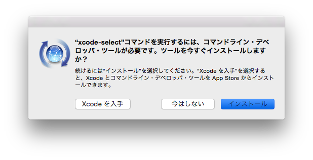
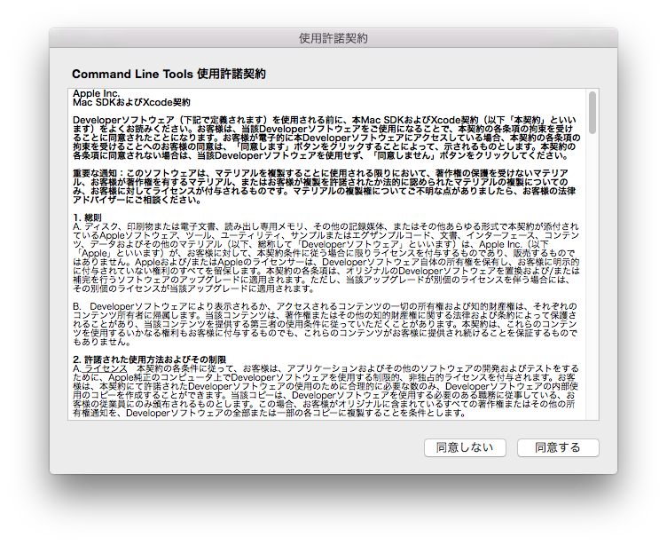
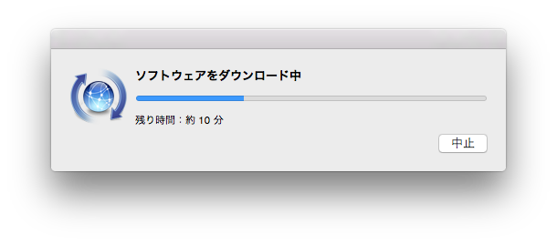
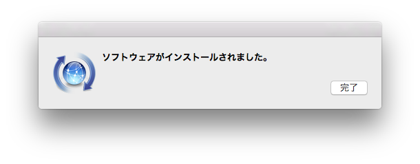
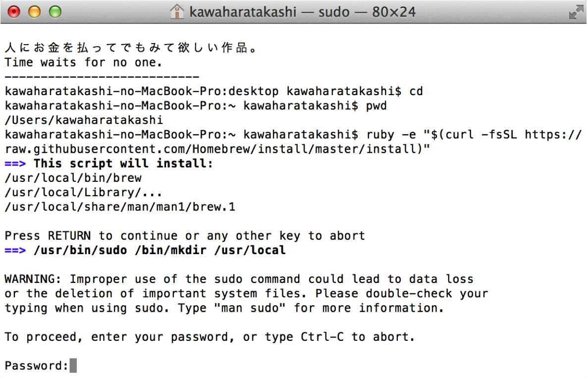
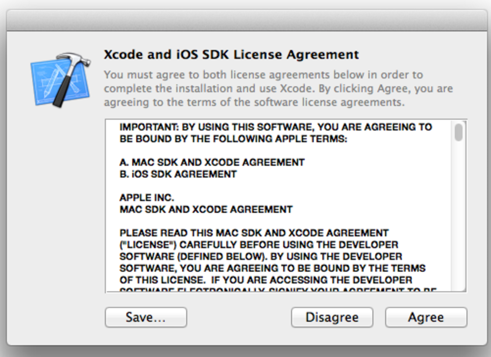
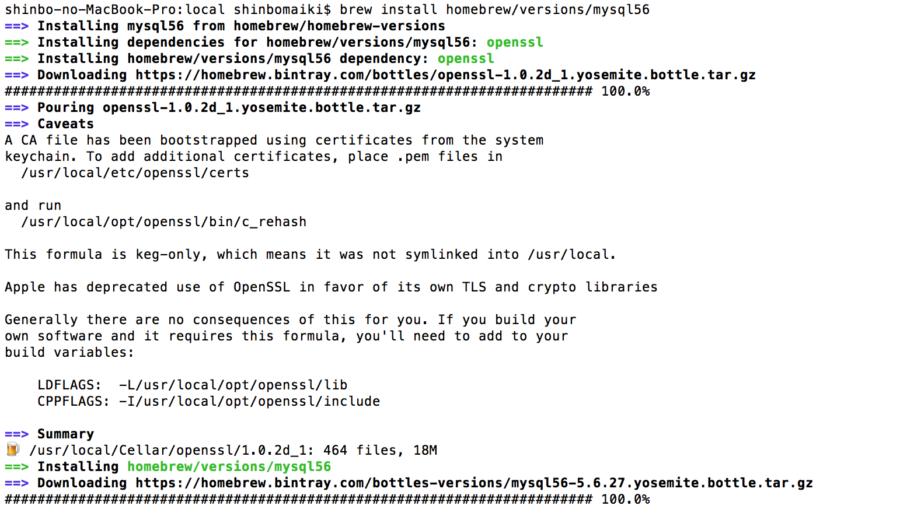

# Laravel開発環境構築 (MacOS版)

# はじめに
## 本章での注意点
本章を進める上での注意点が3つあります。

1. 現在利用中のMacで開発環境を構築したことがある場合、本章の内容に取り組む前に必ずメンターに連絡してください。
2. 途中で何かエラーが発生した場合、必ず作業を中断し、メンターに連絡してください。
3. 本章でターミナルにてコマンドを実行するときは、全てホームディレクトリから行ってください
    - ターミナルで一度 cd コマンドを実行し、ホームディレクトリに移動してからコマンドを入力してください

## 事前に用意するもの
以下のものを事前に準備しておいてください。

### Apple IDとパスワード
- ※AppleIdをお持ちの方（apple製品を利用したことのあるかた）はそれを利用してください。
- AppleIdを忘れた方、もしくはお持ちでない方は[こちらのリンク](https://appleid.apple.com/account#!&page=create)からAppleIdを取得してください

### PC本体のパスワード

# 環境構築
以下に紹介する手順を順番に実行してください。

## Command Line Toolsをインストールしよう
まず、Homebrewというアプリケーションをインストールするのに必要なコマンドを使えるようにするため、Command Line Tools（コマンドラインツール）というものをインストールします。

### 1. Command Line Toolsのインストール
(1) ターミナルを開き、以下の一文を打ち込んでください。

```bash
$ xcode-select --install
```

(2)「インストール」をクリックしてください。


(3)「同意する」をクリックしてください。


(4)Command Line Toolsのダウンロードが始まります。


(5)ダウンロードが終わったら『コマンドを順番に実行しよう』へ進んでください。


以上でCommand Line Toolsのインストールは完了です。

## コマンドを順番に実行しよう

以降は、基本的にはコマンドをターミナルからホームディレクトリ上で実行していくだけです。

以下の手順を見ながら、2~20までの【実行するコマンド】で示されているコマンドを１つずつ実行していってください。

### 2. Homebrewのインストール
**【実行するコマンド】**

```bash
$ #ホームディレクトリに移動
$ cd
$
$ #ホームディレクトリにいるかどうか確認
$ pwd
$
$ #Homebrewのインストール
$ /bin/bash -c "$(curl -fsSL https://raw.githubusercontent.com/Homebrew/install/master/install.sh)"
```

**※処理に時間がかかる可能性のあるコマンドです。**

Homebrew(ホームブルー)というアプリケーションをインストールするためのコマンドです。  
ターミナルを起動し、cd コマンドでホームディレクトリに移動してからコマンドを入力、実行してください。

すると、以下のようにパスワードを要求されます。

また Press RETURN to continue or any other key to abort と表示された行の後は、エンターキーを押してください。  
その後Passwordを入力する画面になります。  
何も入力がないとタイムアウトしてしまいパスワード入力の行まで進めません。



このパスワードは、ご自身のMacのパスワードです。

ターミナル上でパスワードを入力しても文字は表示されません。ですがちゃんと入力はされているので、打ち終わったらエンターキーを押してください。


その後、以下の画像の下部のようにインストールの進行状況が％で表示されるので、インストールが完了するまで待機します。  
再びコマンドを入力できるようになれば成功です。


#### Homebrewについて

Homebrewは、Mac OS上でのソフトウェア管理を行うソフトウェアのことです。  
これを使うことで、インターネット上から便利なアプリケーションを簡単にインストールしたり、そのバージョン管理をすることができます。

これからいくつかのアプリケーションをインストールするのですが、その管理のためにHomebrewをインストールします。

homebrewをインストールしている段階で`Agreeing to the Xcode/iOS license requires admin privileges, please re-run as root via sudo.`というエラーが出た方はXcodeというアプリケーション のライセンスに同意する必要があるので、以下の手順を実行してみてください。

1. Finderのアプリケーションからxcodeを起動
2. agreeをクリック


そしてもう一度homebrewをインストールしてみてください。


### 3. Homebrewがインストールされているか確認
**【実行するコマンド】**

```bash
$ brew -v
```

Homebrewがインストールされているかを確認します。  
以下のように、Homebrewのバージョン情報が表示されれば無事にインストールされています。

```bash
$ brew -v
Homebrew 2.4.7
```

### 4. Homebrewのアップデート
**【実行するコマンド】**

```bash
$ brew update
```

Homebrewを最新バージョンにするためのコマンドです。  
バージョンが既に最新である場合もあります。

### 5. anyenv のインストール
**【実行するコマンド】**

```bash
$ # anyenvのインストール & セットアップ
$ brew install rbenv ruby-build
$ anyenv install --init
$
$ # pathが通るよう設定ファイルを更新し、ターミナルを再起動
$ echo 'eval "$(anyenv init -)"' >> ~/.zshrc
$ exec $SHELL -l
$
$ # anyenvのupdateプラグインをインストール
$ git clone https://github.com/znz/anyenv-update.git ~/.anyenv/plugins/anyenv-update
```

まず、Homebrewを使ってanyenv(エニー・エンブ)をインストールします。  
インストール後、anyenvのセットアップを行います。

その後、パスを通すことで、anyenvをどのディレクトリからも使用できるようにします。  
実行すると、すぐコマンド入力画面になります。

**※必ずMac内蔵のターミナルを使用してください。**  
どうしてもITermや他の物を使用したい場合には、`~/.zshrc`ではなく、適切なprofile名にしてください。


#### パスを通すとは
本来アプリケーションを利用するためにはそのアプリケーションの実行ファイルが存在するディレクトリまで移動するか、実行ファイルの在処を絶対パスで指定する必要があります。

しかし、設定ファイルにコードを書き設定することで、どのディレクトリからもアプリケーションを呼び出せるようになります。  
このことを「パスを通す」と言います。


#### anyenvについて
anyenvは、各種開発言語のバージョン管理ソフトを統合管理するアプリケーションです。  
実際に各種言語のバージョン管理を行うのはrbenv、phpenv等のアプリケーションとなりますが、anyenvを利用することでこれらのアプリケーションを一括して管理することができます。


### 6. phpenv のインストール
**【実行するコマンド】**

```bash
$ # phpenvをインストールし、ターミナルを再起動
$ anyenv install phpenv
$ exec $SHELL -l
$
$ # phpenvの内容を最新に更新
$ anyenv update phpenv
```

PHPのバージョン管理を行うためのphpenv(ピーエイチピー・エンブ)というアプリケーションをインストールします。

phpenvのインストール後、anyenvを利用して利用できるphpのバージョンを最新の状態に更新します。


### 7. PHP のインストール
**【実行するコマンド】**

```bash
$ # 必要なライブラリ群をインストール
$ brew install bzip2 libiconv krb5 icu4c tidy-html5 libzip
$
$ # PHPのインストール
$ PHP_BUILD_CONFIGURE_OPTS="--with-bz2=$(brew --prefix bzip2) --with-iconv=$(brew --prefix libiconv)" PKG_CONFIG_PATH="$(brew --prefix krb5)/lib/pkgconfig:$(brew --prefix openssl)/lib/pkgconfig:$(brew --prefix icu4c)/lib/pkgconfig" phpenv install 7.4.8
$
$ # 設定ファイルを更新し、ターミナルを再起動
$ echo 'eval "$(anyenv init -)"' >> ~/.bash_profile
$ exec $SHELL -l
$
$ # anyenvのupdateプラグインをインストール
$ git clone https://github.com/znz/anyenv-update.git ~/.anyenv/plugins/anyenv-update
```

**※処理に10分程度かかる可能性のあるコマンドです。**

これからの学習で、PHPの7.4.8を使います。


#### なぜ新たにPHPをインストールするのか
Macに最初から入っているPHPは、先ほどインストールしたphpenvでのバージョン管理ができません。  
そのため、phpenvを利用してバージョン管理のできるPHPをインストールする必要があります。


### 8. 利用するPHPのバージョンを決める
**【実行するコマンド】**

```bash
$ phpenv global 7.4.8
```

#### phpenv global コマンド
`phpenv global`コマンドは、デフォルトで使用されるPHPのバージョンを決めることができます。  
フォルダごとにPHPのバージョンを変更したい場合は`phpenv local`コマンドが利用できます。  
localでの指定がある場合は、globalでの設定よりも優先されます。


### 9. PHPのバージョン確認
**【実行するコマンド】**

```bash
$ php -v
7.4.8
```

PHPのバージョンが、8. で設定した7.4.8であることが表示されればOKです。

### 10. MySQLのインストール
**【実行するコマンド】**

```bash
$ brew install mysql@5.6
```

**※処理に時間がかかる可能性のあるコマンドです。**

データベースシステムの`MySQL`(マイエスキューエル)をインストールするコマンドです。  
実行すると以下のようになります。



#### MySQL
MySQLとは、データを保存するデーターベースサーバーの一種です。PHPとLaravelで作るアプリケーションで使用するデータを保存するために利用します。


### 11. MySQLの自動起動設定
**【実行するコマンド】**

```bash
$ brew services start mysql@5.6
```

MySQLを自動で起動するためのコマンドです。
Homebrewを利用してMySQLが自動的に起動するように設定を行います。

以下のコマンドで設定が正常に反映できているかを確認しましょう。

**【実行するコマンド】**

```bash
$ brew services list
```

`mysql@5.6`のstatusが 緑色で `started` と表示されていればOKです。


#### MySQLの自動起動
MySQLは、使用時に起動されてなくてはいけません。  
通常の手順で起動をした場合はPCの電源を落とすとMySQLも終了してしまうため、再度手動で起動する必要があります。

これは面倒なので、PCを起動すると同時にMySQLも自動で起動する設定にしておきます。

### 12. MySQLのalias設定
**【実行するコマンド】**
```bash
$ brew link --force mysql@5.6
```

インストールしたMySQLはpathが通されておらず利用が不便なため、`brew link`コマンドを利用してpathを通します。

#### keg-onlyとpathの設定
基本的にHomebrewでインストールしたソフトウェアは自動でpathが通されるためすぐに利用ができますが、`keg-only`となっている一部のソフトウェアではpathが通されません。  
これは「Macに初めからインストールされているソフトウェア」や「最新ではない過去のバージョンのソフトウェア」の場合に、意図しない挙動を起こさないための仕組みとなっています。  
今回インストールしたMySQLは`5.6`と少し古いものとなっているため`keg-only`となっています。

[戻る](/web_application/index.md) /
[トップへ](/README.md)