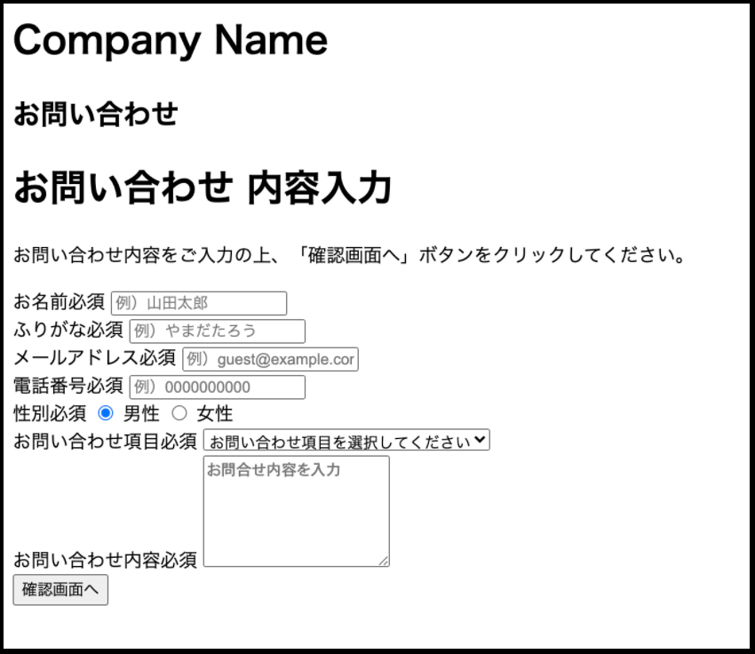
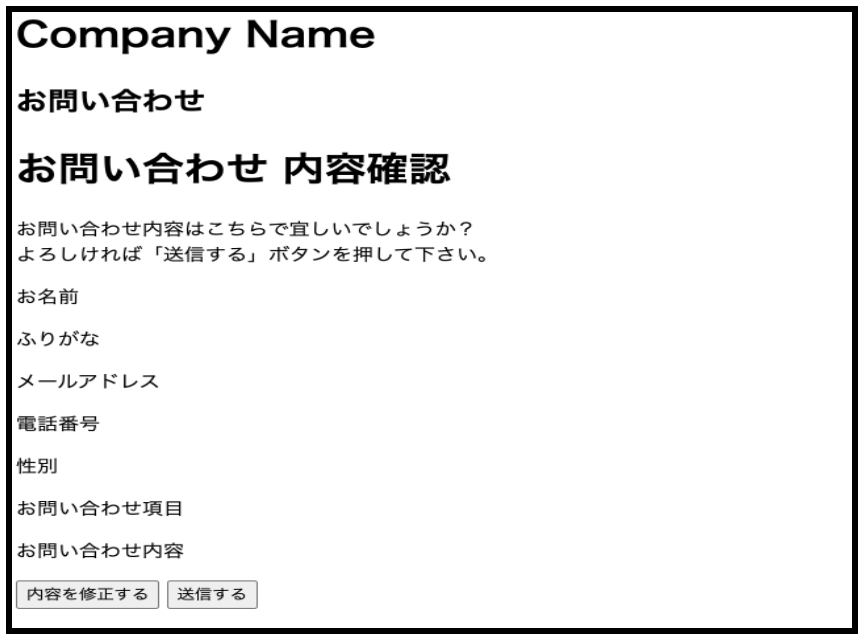
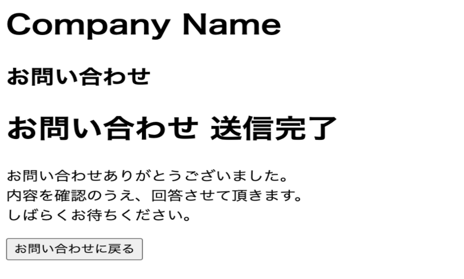

# 目次
1. 環境構築
1. お問い合わせフォームの作成
1. お問い合わせ内容 確認画面の作成
1. お問い合わせ内容 サンクス画面の作成

それぞれのリンクをクリックするときは、別タブで開く癖をつけましょう。

「⌘ + クリック」(Mac) /「Ctrl + クリック」(Windows)


## 1.環境構築
- [環境構築（Mac）](/web_application/app_php/build_formac.md)
- [環境構築（Windows/cloud9）](/web_application/app_php/build_forcloud9.md)


## 2.お問い合わせフォームの作成
input.phpファイルを作成して、以下のコードをコピペしましょう。（保存を忘れずに！！）
作業手順（お問い合わせフォームの作成）

```bash
<!DOCTYPE html>
<html lang="ja">
<head>
<meta charset="UTF-8">
<title>お問い合わせフォーム</title>
<link rel="stylesheet" href="style.css">
<script type="text/javascript" src="contact.js"></script>
</head>
<body>
<div><h1>Company Name</h1></div>
<div><h2>お問い合わせ</h2></div>
<div>
    <form action="confirm.php" method="post" name="form" onsubmit="return validate()">
        <h1 class="contact-title">お問い合わせ 内容入力</h1>
        <p>お問い合わせ内容をご入力の上、「確認画面へ」ボタンをクリックしてください。</p>
        <div>
            <div>
                <label>お名前<span>必須</span></label>
                <input type="text" name="name" placeholder="例）山田太郎" value="">
            </div>
            <div>
                <label>ふりがな<span>必須</span></label>
                <input type="text" name="furigana" placeholder="例）やまだたろう" value="">
            </div>
            <div>
                <label>メールアドレス<span>必須</span></label>
                <input type="text" name="email" placeholder="例）guest@example.com" value="">
            </div>
            <div>
                <label>電話番号<span>必須</span></label>
                <input type="text" name="tel" placeholder="例）0000000000" value="">
            </div>
            <div>
                <label>性別<span>必須</span></label>
                <input type="radio" name="sex" value="男性" checked> 男性
                <input type="radio" name="sex" value="女性"> 女性
            </div>
            <div>
                <label>お問い合わせ項目<span>必須</span></label>
                <select name="item">
                    <option value="">お問い合わせ項目を選択してください</option>
                    <option value="ご質問・お問い合わせ">ご質問・お問い合わせ</option>
                    <option value="ご意見・ご感想">ご意見・ご感想</option>
                </select>
            </div>
            <div>
                <label>お問い合わせ内容<span>必須</span></label>
                <textarea name="content" rows="5" placeholder="お問合せ内容を入力"></textarea>
            </div>
        </div>
        <button type="submit">確認画面へ</button>
    </form>
</div>
</body>
</html>
```
下記のように表示されます。



## 3.お問い合わせ内容 確認画面の作成
confirm.phpファイルを作成して、以下のコードをコピペしましょう。（保存を忘れずに！！）

```bash
<?php 
    // もしお問い合わせフォームの[確認]ボタンが押されたら
    if ($_SERVER["REQUEST_METHOD"] == "POST") {
        // お問い合わせフォームから送信されたデータを各変数に格納する
        $name = $_POST["name"];
        $furigana = $_POST["furigana"];
        $email = $_POST["email"];
        $tel = $_POST["tel"];
        $sex = $_POST["sex"];
        $item = $_POST["item"];
        $content  = $_POST["content"];
    }

    // もしお問い合わせ内容確認画面の送信ボタンが押されたら
    if (isset($_POST["submit"])) {
        // メールで送る言語を日本語に設定（メールの文字化けを防ぐ）
        mb_language("ja");
        mb_internal_encoding("UTF-8");
        
        
            // 件名を変数subjectに格納
            $subject = "［自動送信］お問い合わせ内容の確認";

            // メール本文を変数bodyに格納（長い文字列の代入）
        $body = <<< EOM
{$name}　様

お問い合わせありがとうございます。
以下のお問い合わせ内容を、メールにて確認させていただきました。

===================================================
【 お名前 】 
{$name}

【 ふりがな 】 
{$furigana}

【 メール 】 
{$email}

【 電話番号 】 
{$tel}

【 性別 】 
{$sex}

【 項目 】 
{$item}

【 内容 】 
{$content}
===================================================

内容を確認のうえ、回答させて頂きます。
しばらくお待ちください。
EOM;
        
        // 送信元のメールアドレスを変数fromEmailに格納
        $fromEmail = "info.techquest0706@gmail.com";

        // 送信元の名前を変数fromNameに格納
        $fromName = "お問い合わせテスト";

        // ヘッダ情報を変数headerに格納する      
        $header = "From: " .mb_encode_mimeheader($fromName) ."<{$fromEmail}>";

        // メール送信を行う
        mb_send_mail($email, $subject, $body, $header);

        // サンクスページに画面遷移させる
        header("Location: http://localhost:8080/thanks.php");
        exit;
    }
?>
<html lang="ja">
<head>
<meta charset="UTF-8">
<title>お問い合わせフォーム</title>
<link rel="stylesheet" href="style.css">
</head>
<body>
<div><h1>Company Name</h1></div>
<div><h2>お問い合わせ</h2></div>
<div>
    <form action="confirm.php" method="post">
            <input type="hidden" name="name" value="<?php echo $name; ?>">
            <input type="hidden" name="furigana" value="<?php echo $furigana; ?>">
            <input type="hidden" name="email" value="<?php echo $email; ?>">
            <input type="hidden" name="tel" value="<?php echo $tel; ?>">
            <input type="hidden" name="sex" value="<?php echo $sex; ?>">
            <input type="hidden" name="item" value="<?php echo $item; ?>">
            <input type="hidden" name="content" value="<?php echo $content; ?>">
            <h1 class="contact-title">お問い合わせ 内容確認</h1>
            <p>お問い合わせ内容はこちらで宜しいでしょうか？<br>よろしければ「送信する」ボタンを押して下さい。</p>
            <div>
                <div>
                    <label>お名前</label>
                    <p><?php echo $name; ?></p>
                </div>
                <div>
                    <label>ふりがな</label>
                    <p><?php echo $furigana; ?></p>
                </div>
                <div>
                    <label>メールアドレス</label>
                    <p><?php echo $email; ?></p>
                </div>
                <div>
                    <label>電話番号</label>
                    <p><?php echo $tel; ?></p>
                </div>
                <div>
                    <label>性別</label>
                    <p><?php echo $sex ?></p>
                </div>
                <div>
                    <label>お問い合わせ項目</label>
                    <p><?php echo $item; ?></p>
                </div>
                <div>
                    <label>お問い合わせ内容</label>
                    <p><?php echo nl2br($content); ?></p>
                </div>
            </div>
        <input type="button" value="内容を修正する" onclick="history.back(-1)">
        <button type="submit" name="submit">送信する</button>
    </form>
</div>
</body>
</html>
```

下記のように表示されます。


## 4.お問い合わせ内容 サンクス画面の作成
thanks.phpファイルを作成して、以下のコードをコピペしましょう。（保存を忘れずに！！）

```bash
<!DOCTYPE html>
<html lang="ja">
<head>
<meta charset="UTF-8">
<title>お問い合わせフォーム</title>
<link rel="stylesheet" href="style.css">
</head>
<body>
<div><h1>Company Name</h1></div>
<div><h2>お問い合わせ</h2> </div>
<div>
        <div>
        <h1>お問い合わせ 送信完了</h1>
        <p>
        お問い合わせありがとうございました。<br>
        内容を確認のうえ、回答させて頂きます。<br>
        しばらくお待ちください。
        </p>
        <a href="input.php">
            <button type="button">お問い合わせに戻る</button>
        </a>
    </div>
</div>
</body>
</html>
```
下記のように表示されます。


最後にお問い合わせ内容を記入して正常に動くか確認してみましょう！！
自分のメールアドレスを入力すると、自分のメールに自動送信されるようになっていますのでぜひやってみてください！


## 課題
①下記コードをconfirm.phpファイルにコピペし、上書き保存すると、
お問い合わせ内容確認画面からにサンクスページに画面遷移されなくなります。
コードを修正して画面遷移されるようにしてみましょう。

```bash
<?php 
    // もしお問い合わせフォームの[確認]ボタンが押されたら
    if ($_SERVER["REQUEST_METHOD"] == "POST") {
        // お問い合わせフォームから送信されたデータを各変数に格納する
        $name = $_POST["name"];
        $furigana = $_POST["furigana"];
        $email = $_POST["email"];
        $tel = $_POST["tel"];
        $sex = $_POST["sex"];
        $item = $_POST["item"];
        $content  = $_POST["content"];
    }

    // もしお問い合わせ内容確認画面の送信ボタンが押されたら
    if (isset($_POST["submit"])) {
        // メールで送る言語を日本語に設定（メールの文字化けを防ぐ）
            mb_language("ja");
        mb_internal_encoding("UTF-8");
        
        //mb_send_mail("kanda.it.school.trial@gmail.com", "メール送信テスト", "メール本文");

            // 件名を変数subjectに格納
            $subject = "［自動送信］お問い合わせ内容の確認";

            // メール本文を変数bodyに格納（長い文字列の代入）
        $body = <<< EOM
{$name}　様

お問い合わせありがとうございます。
以下のお問い合わせ内容を、メールにて確認させていただきました。

===================================================
【 お名前 】 
{$name}

【 ふりがな 】 
{$furigana}

【 メール 】 
{$email}

【 電話番号 】 
{$tel}

【 性別 】 
{$sex}

【 項目 】 
{$item}

【 内容 】 
{$content}
===================================================

内容を確認のうえ、回答させて頂きます。
しばらくお待ちください。
EOM;
        
        // 送信元のメールアドレスを変数fromEmailに格納
        $fromEmail = "info.techquest0706@gmail.com";

        // 送信元の名前を変数fromNameに格納
        $fromName = "お問い合わせテスト";

        // ヘッダ情報を変数headerに格納する      
        $header = "From: " .mb_encode_mimeheader($fromName) ."<{$fromEmail}>";

        // メール送信を行う
        mb_send_mail($email, $subject, $body, $header);

        // サンクスページに画面遷移させる
        header("Location: http://localhost:8080/thanks.php");
        exit;
    }
?>
<html lang="ja">
<head>
<meta charset="UTF-8">
<title>お問い合わせフォーム</title>
<link rel="stylesheet" href="style.css">
</head>
<body>
<div><h1>Company Name</h1></div>
<div><h2>お問い合わせ</h2></div>
<div>
    <form action="confirm.php" method="post">
            <input type="hidden" name="name" value="<?php echo $name; ?>">
            <input type="hidden" name="furigana" value="<?php echo $furigana; ?>">
            <input type="hidden" name="email" value="<?php echo $email; ?>">
            <input type="hidden" name="tel" value="<?php echo $tel; ?>">
            <input type="hidden" name="sex" value="<?php echo $sex; ?>">
            <input type="hidden" name="item" value="<?php echo $item; ?>">
            <input type="hidden" name="content" value="<?php echo $content; ?>">
            <h1 class="contact-title">お問い合わせ 内容確認</h1>
            <p>お問い合わせ内容はこちらで宜しいでしょうか？<br>よろしければ「送信する」ボタンを押して下さい。</p>
            <div>
                <div>
                    <label>お名前</label>
                    <p><?php echo $name; ?></p>
                </div>
                <div>
                    <label>ふりがな</label>
                    <p><?php echo $furigana; ?></p>
                </div>
                <div>
                    <label>メールアドレス</label>
                    <p><?php echo $email; ?></p>
                </div>
                <div>
                    <label>電話番号</label>
                    <p><?php echo $tel; ?></p>
                </div>
                <div>
                    <label>性別</label>
                    <p><?php echo $sex ?></p>
                </div>
                <div>
                    <label>お問い合わせ項目</label>
                    <p><?php echo $item; ?></p>
                </div>
                <div>
                    <label>お問い合わせ内容</label>
                    <p><?php echo nl2br($content); ?></p>
                </div>
            </div>
        <input type="button" value="内容を修正する" onclick="history.back(-1)">
        <button type="submit" name="submit">送信する</button>
    </form>
</div>
</body>
</html>
```


[戻る](/web_application/index.md) /
[トップへ](/README.md)