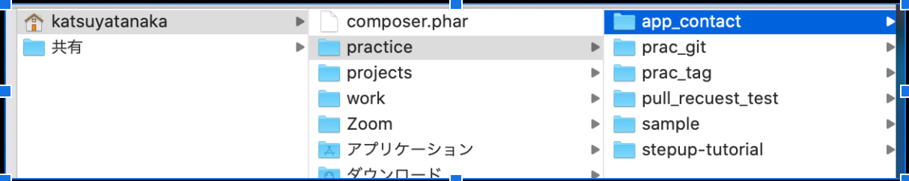

# 作業手順
1. input.phpファイルを作成
1. コードのコピペ
1. 表示の確認

## 1.input.phpファイルを作成
ホームディレクトリ（ここでは、katsuyatanaka）の下にpracticeディレクトリを作成
practiceディレクトリの下にapp_contactディレクトリを作成
practiceディレクトリの下にinput.phpファイルを作成

実際にターミナルでディレクトリを作成していきましょう！

コマンドの入力手順
pwd
mkdir practice
cd practice
mkdir app_contact
ls -la
cd app_contact
touch input.php
ls -la
コマンドの説明
pwd → 現在のディレクトリの位置の確認
mkdir ディレクトリ名 → ディレクトリの作成
cd practice → ディレクトリの移動
ls -la → 現在のディレクトリの下にあるディレクトリを見る
touch ファイル名 → ファイルの作成

## 2.コードのコピペ&保存
参考: VScode使い方
VScodeを開く
input.php ファイルにコードをコピペ
変更を保存（command + S で保存できる）

## 3.表示の確認
「http://localhost:8080/input.php」のURLをブラウザーで検索
下記のように表示されればOK
