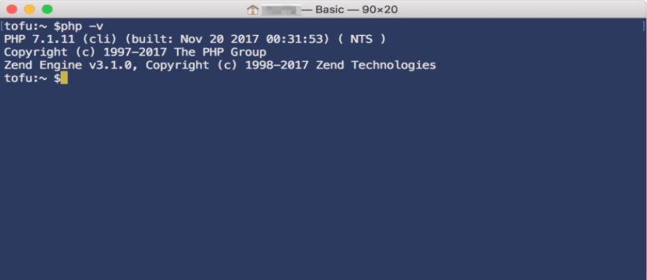
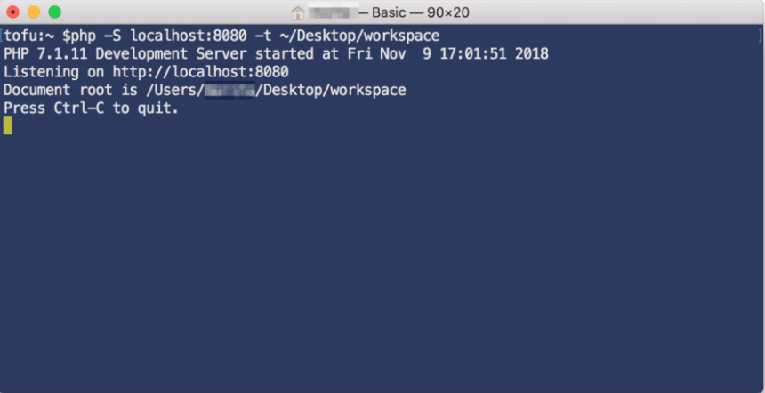
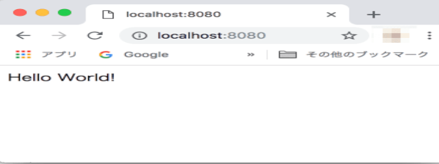

# 目次
1. PHPのバージョンを確認する。
1. ファイルにサンプルコードを入力。
1. ビルトインサーバーを起動。

それぞれのリンクをクリックするときは、別タブで開く癖をつけましょう。

「⌘ + クリック」(Mac) /「Ctrl + クリック」(Windows)


## ①PHPのバージョンを確認する。
ターミナルに下記のコマンドを入力してエンターを押して確認。
PHP5.4以上なら大丈夫です。

```bash
$ php -v
```


## ②ファイルにサンプルコードを入力
作成してあるファイルに、以下の記述をして保存します。
今回は、「Hello World!」と表示させてみたいと思います。
 
※index.phpファイルを作成する必要があります。

※ビルトインサーバーは、index.phpという名前のファイルがデフォルトで「http://localhost:8080」で表示されるようになっています。

※「http://localhost:8080」は、「http://localhost:8080/index.php」が省略されたリンクです。

```bash
<?php echo 'Hello World!';
```


## ③ビルトインサーバー を起動
ビルトインサーバーを立ち上げるコマンドをターミナルに入力します。

```bash
$ php -S localhost:8080 -t ~/Desktop/workspace
```
各コマンドの意味はこちら。

$ php -S localhost:8080 -t ~/Desktop/workspace

-S
ビルトインサーバーを立ち上げるオプション。

localhost:8080
自分のローカル環境の8080ポートを使用する指定。

-t
ドキュメントルートの指定。
-tの後にドキュメントルートのパスを指定できます。

画像のように表示されればOKです！
これで、サーバーが立ち上がったので、表示されているように「http://localhost:8080」にブラウザからアクセスしてみます。





[戻る](/web_application/index.md) /
[トップへ](/README.md)