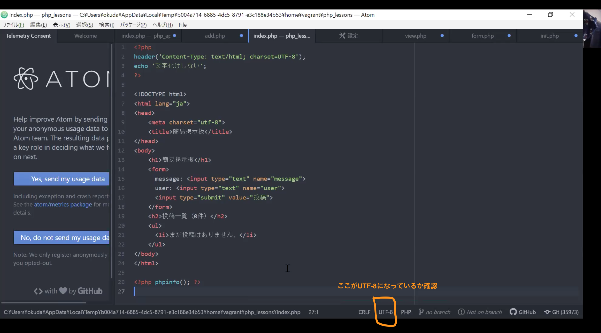

# 環境構築
それぞれのリンクをクリックするときは、別タブで開く癖をつけましょう。

「⌘ + クリック」(Mac) /「Ctrl + クリック」(Windows)

## 1.環境構築にトライしよう
- [Mac版](https://dotinstall.com/lessons/basic_localdev_mac_v2)
- [Windows版](https://dotinstall.com/lessons/basic_localdev_win_v2)

### Windows版の環境構築後に文字化けした場合は下記を確認しよう


## 2.検索してみよう
もう少し詳しく調べてみたい方は、
```
PHP 環境構築
```
で調べてみましょう！

[戻る](/web_application/index.md) /
[トップへ](/README.md)