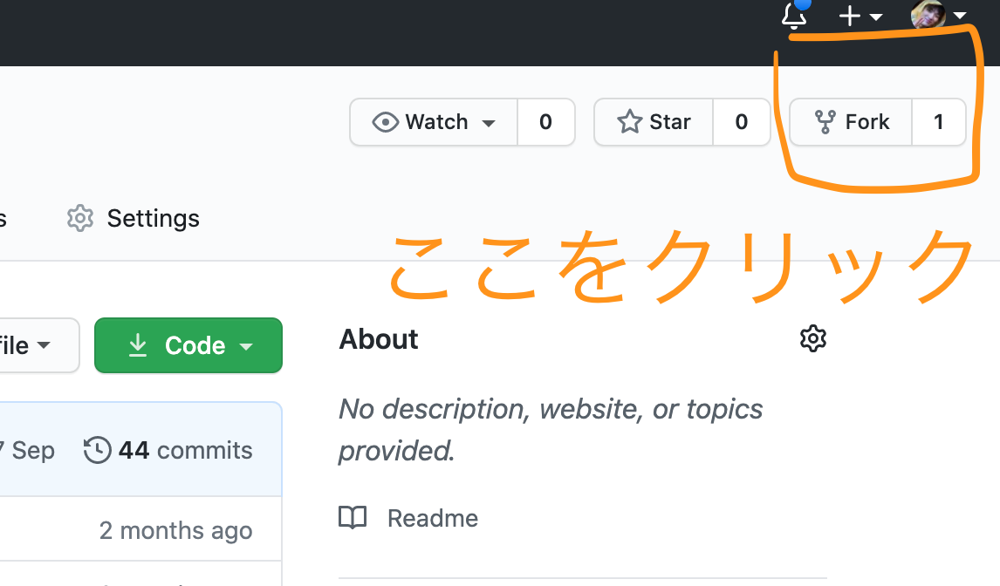
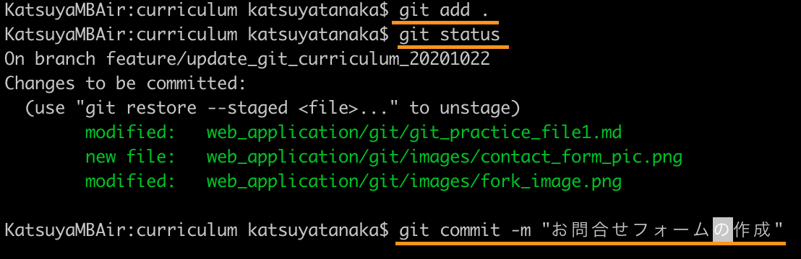

# Gitとは

    開発を行う際に使われるシステム

## 練習1の流れ

1. 他人のアカウントのリモートリポジトリをコピーする


1. リモートリポジトリをローカルリポジトリにコピーする


1. 機能を追加


1. リモートリポジトリに変更履歴を共有


## やってみよう

1. 他人のアカウントのリモートリポジトリをコピーする


    1. コピーしたいリポジトリがあるGithubアカウントでforkをクリック
    1. コピー先のアカウントを選択する

    [ここからコピーするアカウントへ](https://github.com/KatsuyaTanaka95/app_contact/commit/ee4a5ee0b104b06a82434d874fc9c00b1b008111)
    

1. リモートリポジトリをローカルリポジトリにコピーする

    1. リポジトリパスをコピー
        
    2. Cloneするディレクトリを作成
    3. Cloneするディレクトリに移動
    4. ターミナルでコマンドを打つ

        ```bash
        $ git clone ［リポジトリパス］
        ```

    5. 使用するディレクトリに移動

        ```
        $ cd [使うディレクトリ名]
        ```
    
    6. エディタで開く

        

1. 機能を追加
    ```
    お問い合わせフォームの作成(input.phpファイルを作成)
    ```
    [参考](/web_application/app_php/app_contact_form_php_formac.md) 

1. リモートリポジトリに変更履歴を共有
##### #慣れるまでは逐一 「git status」を使うようにしましょう
    ```
    $ git status
    $ git add .   
    $ git status
    $ git commit  -m “コミットメッセージ”
    $ git status
    $ git push origin
    ```

    ##### 慣れてきたらこの3つのコマンドだけで大丈夫です！
    ```
    $ git add .   
    $ git commit  -m “コミットメッセージ”
    $ git push origin
    ```


再度、 `git clone` して練習しましょう！

慣れてきたら次のステップに進みましょう！！

[戻る](/web_application/index.md) /
[トップへ](/README.md)