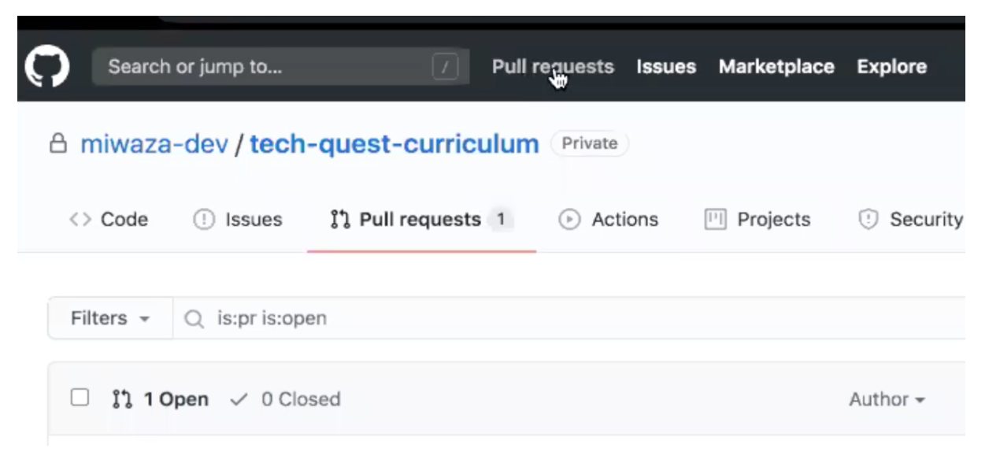
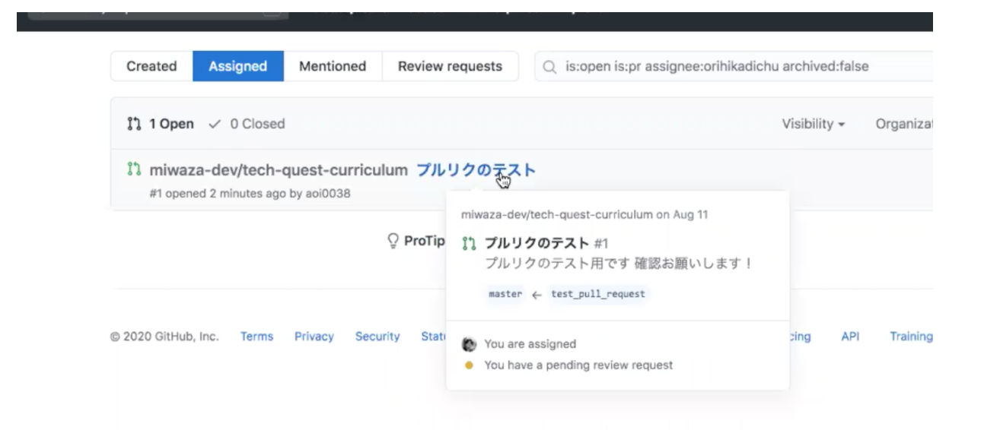
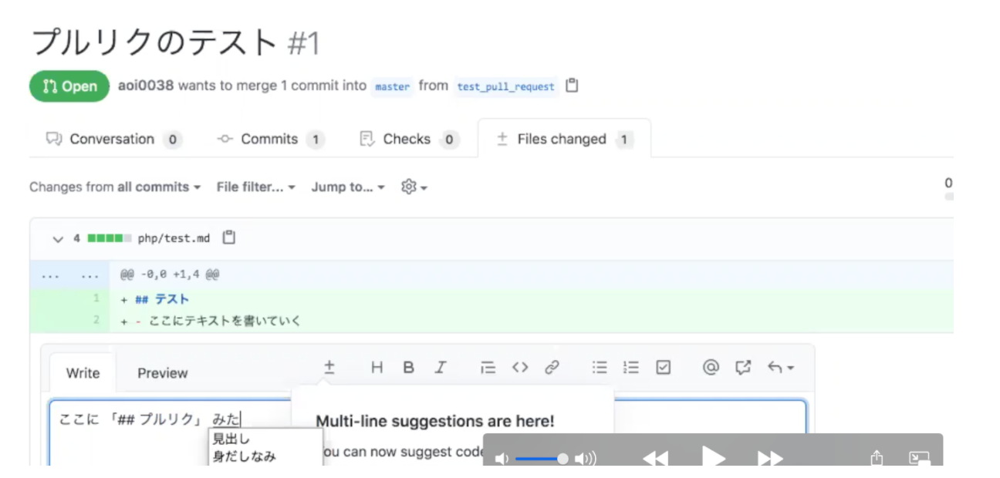
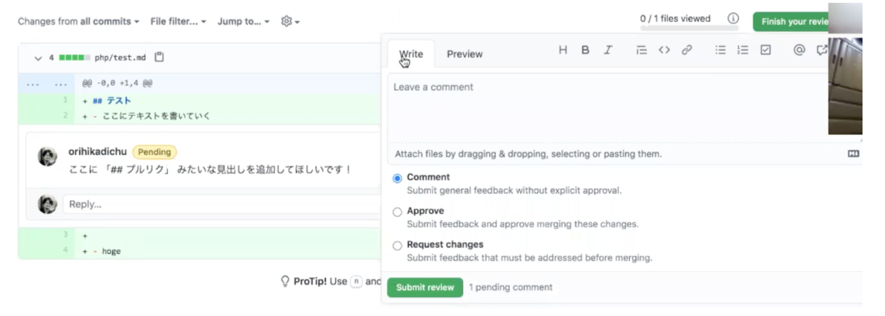
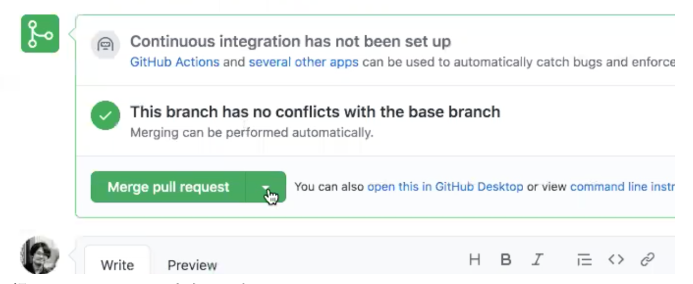
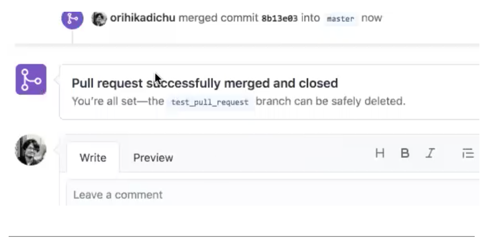

## Gitとは
    開発を行う際に使われるシステム

## 練習3の流れ
1. 他人のアカウントのリモートリポジトリをコピーする


1. リモートリポジトリをローカルリポジトリにコピーする


1. ブランチの作成


1. 機能を追加


1. リモートリポジトリに変更履歴を共有


1. プルリクエストの作成
1. マージ(追加機能を反映)


## やってみよう
1. 他人のアカウントのリモートリポジトリをコピーする
    - 練習1でやったことをおもいだしてみよう
1. リモートリポジトリをローカルリポジトリにコピーする
    - 練習1でやったことをおもいだしてみよう
1. ブランチの作成
    - 練習2でやったことをおもいだしてみよう
1. 機能を追加
    - 練習1でやったことをおもいだしてみよう
1. リモートリポジトリに変更履歴を共有
    - 練習1でやったことをおもいだしてみよう
1. プルリクエストの作成

    [参考URL](https://ics.media/entry/14449/)
1. マージ
    1. Github を開き、Pull requests をクリック
    
    1. Pull requests されたものをクリック
    
    1. コメント、修正依頼を書く
        ```
        1.右上の Files changed を選択。
        2.変更箇所の左にある + ボタンを選択肢。
        3.コメントを書く。
        ```
       
    1. コメント、修正依頼を送信
        ```
        1.Pending と表示される
        2.右上の Finish your reviwes をクリック
        3.3つの選択肢から正しいものを選び、submit reviwe をクリック
        ```
        
    1. マージする
        
        ```
        1.緑の Merge pull request ボタンをクリック
        ```
        
        ```
        2.緑の Confirm merge をクリック
        ```
        
        
