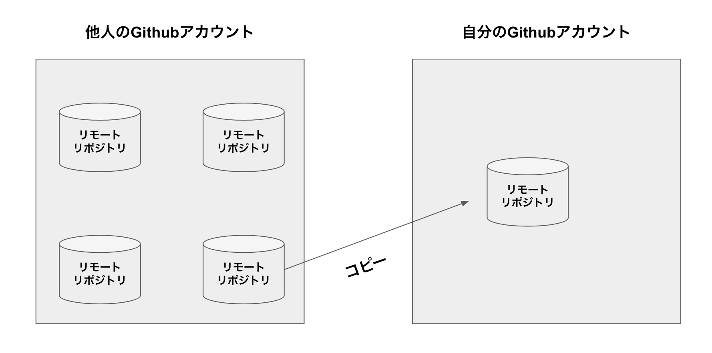
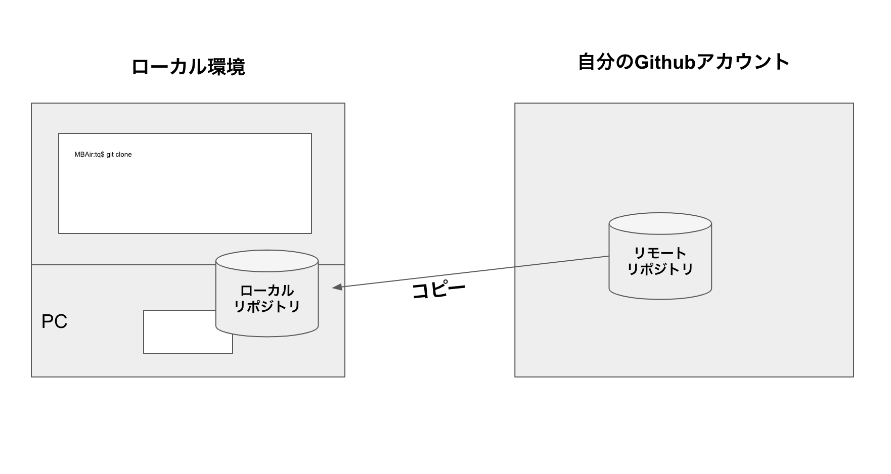
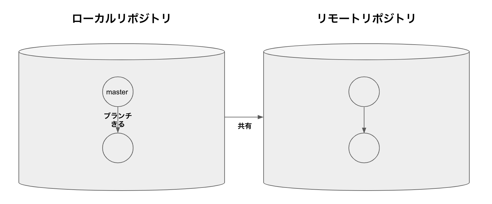
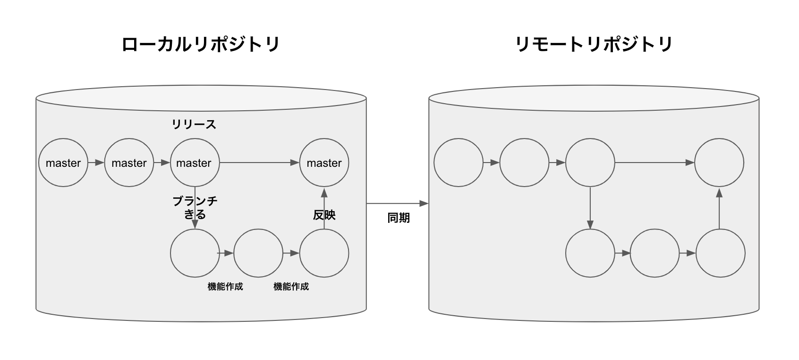
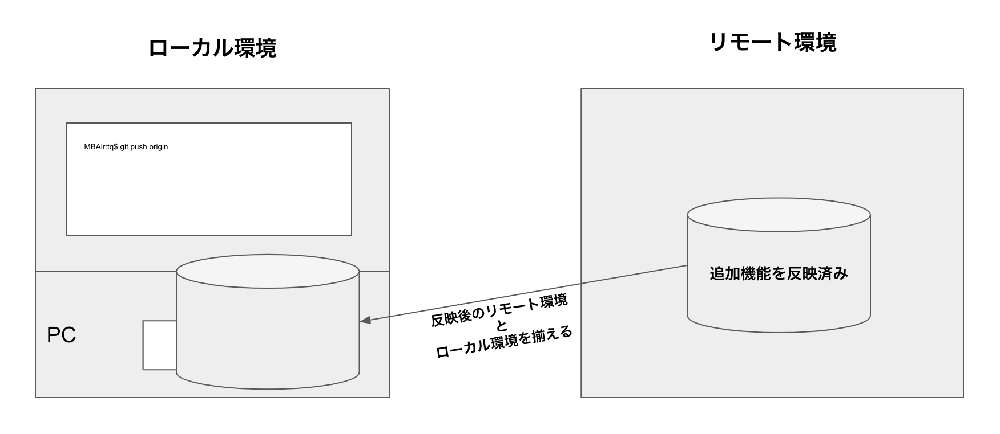

## Gitとは
    開発を行う際に使われるシステム

## 練習4の流れ
1. 他人のアカウントのリモートリポジトリをコピーする


1. リモートリポジトリをローカルリポジトリにコピーする


1. ブランチの作成


1. 機能を追加


1. リモートリポジトリに変更履歴を共有


1. プルリクエストの作成
1. 新しいブランチ作成

1. 機能追加
1. マージ(追加機能を反映)


1. ブランチの状態を最新にあわせる


## やってみよう
1. 他人のアカウントのリモートリポジトリをコピーする
    - 練習1でやったことをおもいだしてみよう
1. リモートリポジトリをローカルリポジトリにコピーする
    - 練習1でやったことをおもいだしてみよう
1. ブランチの作成
    - 練習2でやったことをおもいだしてみよう
1. 機能を追加
    - 練習1でやったことをおもいだしてみよう
1. リモートリポジトリに変更履歴を共有
    - 練習1でやったことをおもいだしてみよう
1. プルリクエストの作成
    - 練習3でやったことをおもいだしてみよう
1. 新しいブランチ作成
    ```
    git branch -a
    git checkout (master)
    git checkout -b 作成するブランチ名
    git branch -a
    git push -u origin 作成したブランチ名
    ```
1. 機能追加
    - 練習1でやったことをおもいだしてみよう
1. マージ
    - 練習3でやったことをおもいだしてみよう
1. ブランチの状態を最新にあわせる
    ```
    git add .
    git commit “コミットメッセージ”
    git checkout (master)
    git pull origin
    git checkout ブランチ名
    git branch -a
    git rebase (master)
    git push origin --force-with-lease
    ```
1. プルリクエストの作成
    - 練習3でやったことをおもいだしてみよう
1. マージ
    - 練習3でやったことをおもいだしてみよう

## 解説
    git checkout (master) = (master) ブランチに移動する

    git pull origin = リモートリポジトリの選択したブランチ から最新状態をローカルブランチの選択したブランチに反映させる

    git rebase (master) = 現在いるブランチの状態と指定したブランチの状態をあわせる

    git push origin --force-with-lease = ローカルとリモートを比較しローカルが最新か確認。
    最新でなければ、PUSHを失敗にしてくれる。

