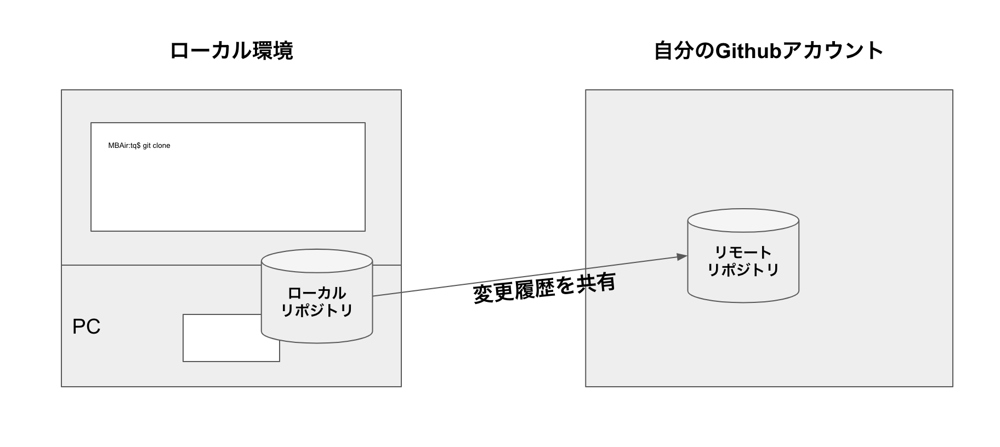
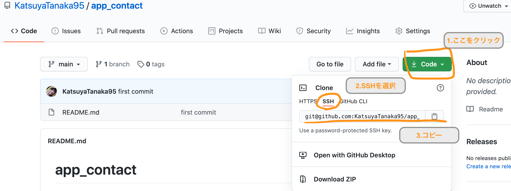
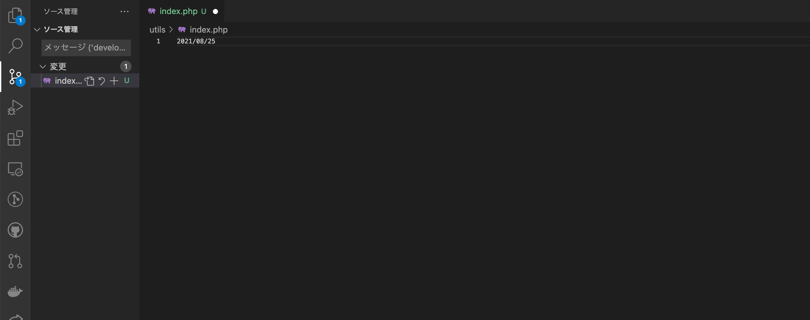
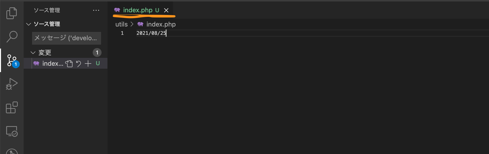
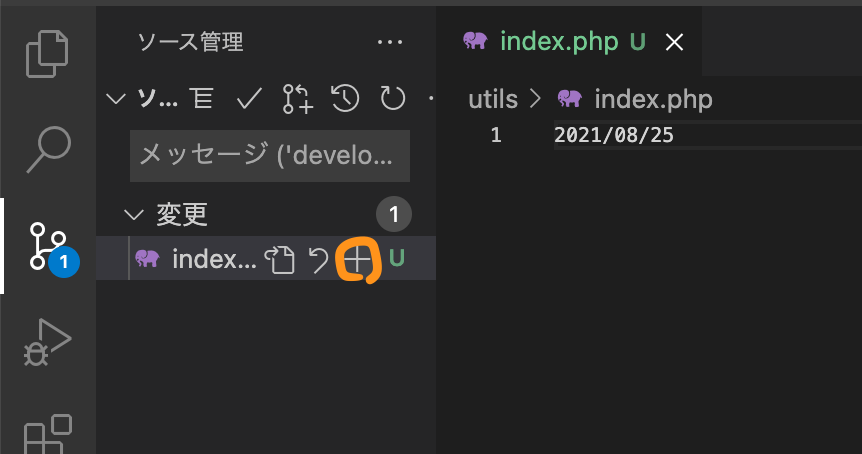
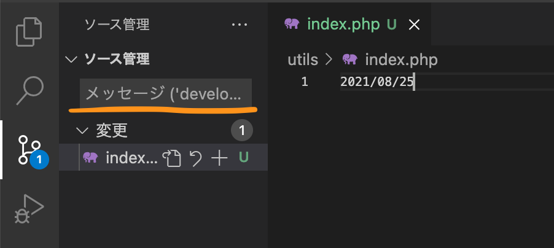
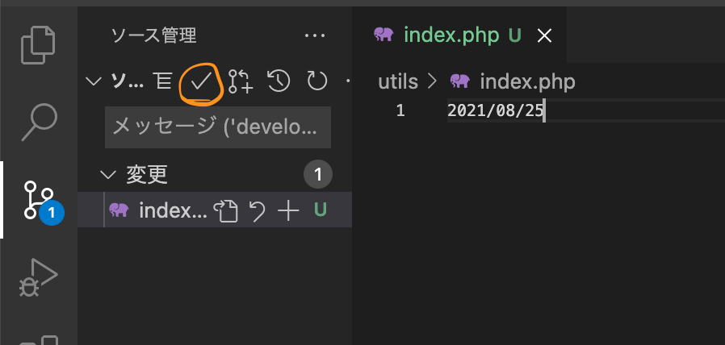
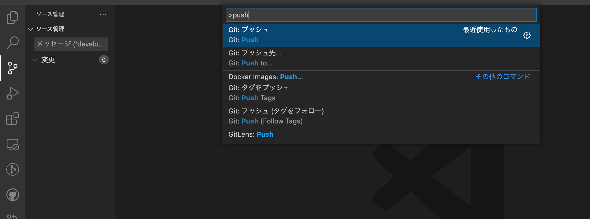

# Gitの練習1

## 流れ

1. リモートリポジトリをローカルリポジトリにコピーする


1. 機能を追加


1. リモートリポジトリに変更履歴を共有


## やってみよう

### ①リモートリポジトリをローカルリポジトリにコピーする

1. Cloneするディレクトリに移動(ない場合は作成)
    ```
    // ディレクトリがない場合
    $ mkdir practice
    $ cd practice

    // ディレクトリがすでにある場合
    $ cd practice
    ```
1. リポジトリパスをコピー

1. ターミナルでコマンドを打つ
    ```
    $ git clone ［リポジトリパス(上の図の3でコピーしたもの)］
    ```
1. クローンしたディレクトリに移動
    ```
    $ cd [使うディレクトリ名]
    ```
1. VSCodeを開く
    ```
    $ code .
    ```


### ②index.phpファイルの修正(ない場合は作成)と反映
1. index.phpファイルに今日の日付を書く

    日付記入後は、「command + s」をして編集を保存。( ※Windowsは、「control + s」「です。)
    
   編集を保存すると白丸がなくなります。 
    

1. リモートリポジトリに変更履歴を反映させる準備

    +ボタンを押します！
    
    コメントを書きます！(ex 今日の日付に修正)
    
    修正の反映の準備をします！
        

1. リモートリポジトリに変更履歴を反映させる 

    「command + shift + p」をクリックし、「push」と検索！「Git: Push」をクリックします！
        