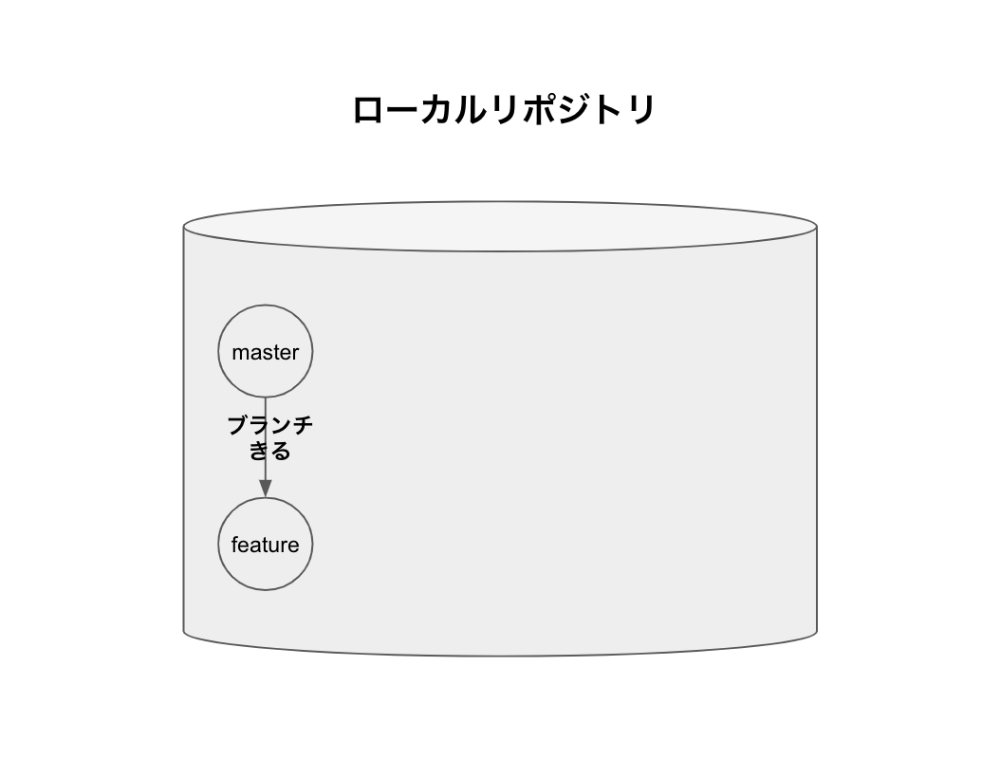
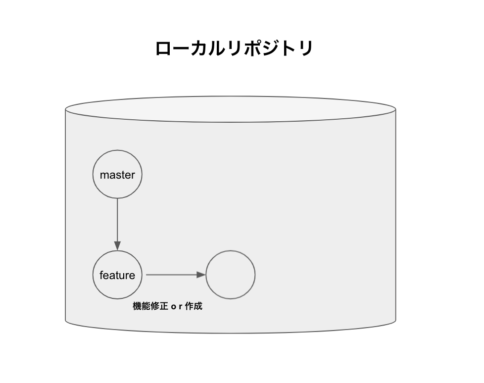
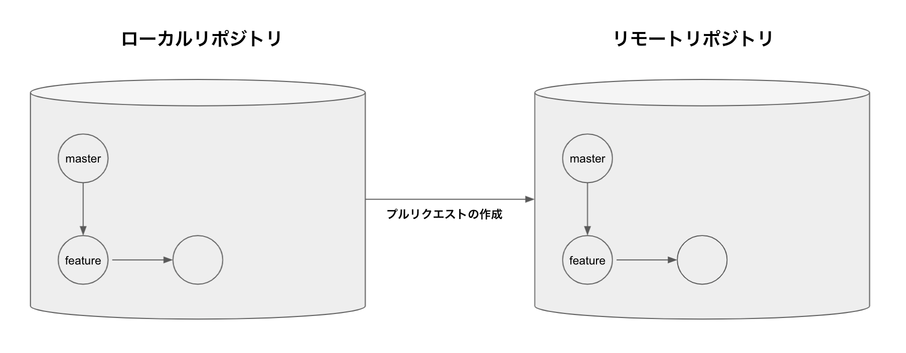
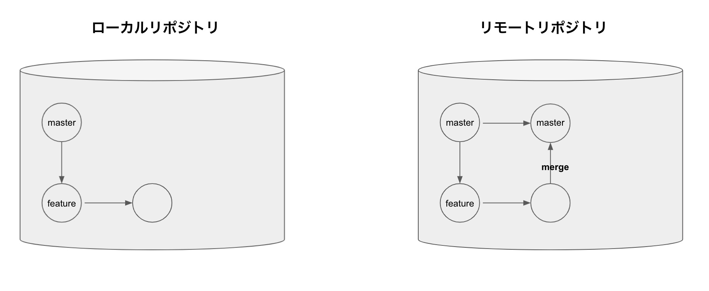
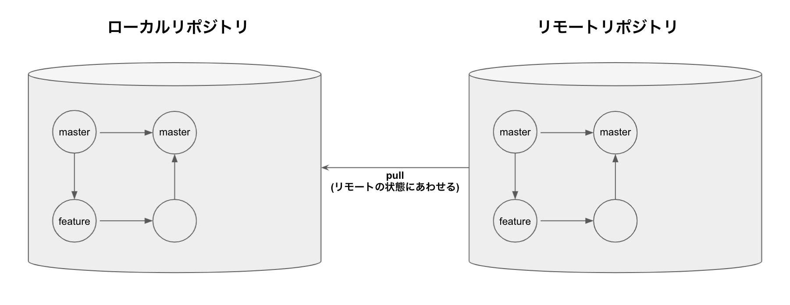
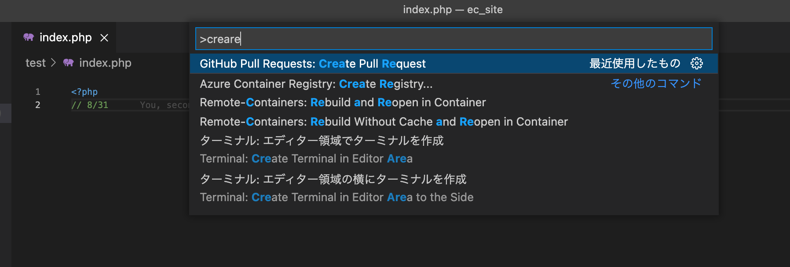
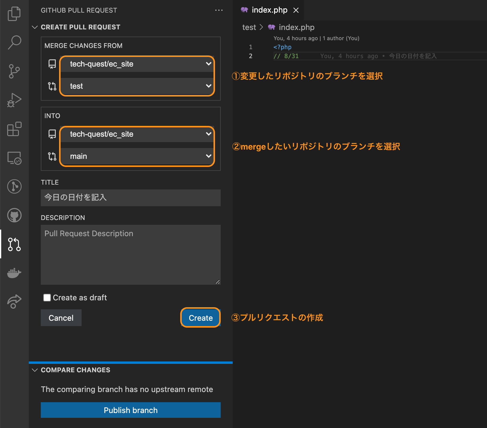
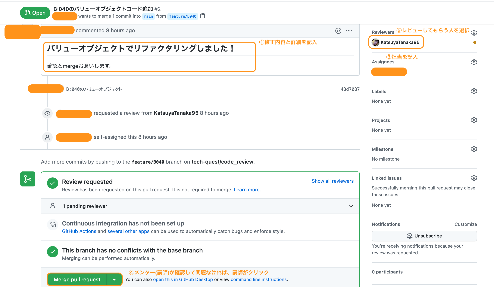
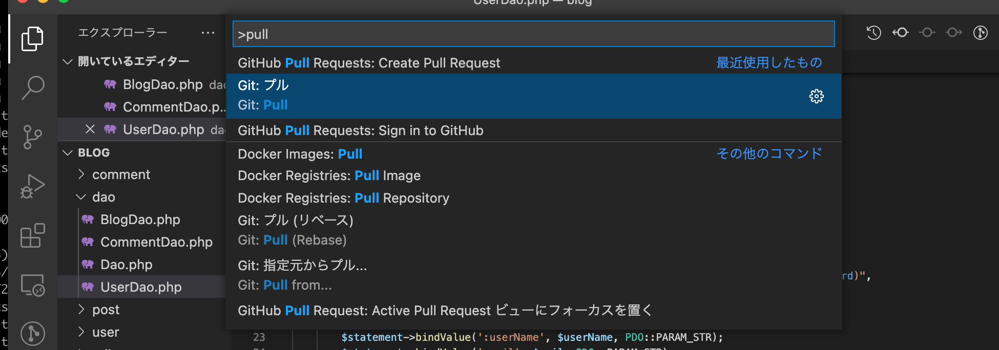

# Gitの練習2

## 流れ

1. リモートリポジトリをローカルリポジトリにコピーする

    

1. ブランチの作成(コードを修正するためにコピーを作成)

    

1. コードを追加または修正

    

1. プルリクエストの作成(コードレビューしてもらう準備)

    

1. コードレビューとmergeをしてもらう

    

1. pullする(リモートの状態をローカルに反映する)

    

## やってみよう

### ①リモートリポジトリをローカルリポジトリにコピーする
    git clone してください

### ②ブランチの作成(コードを修正するためにコピーを作成)

### ③index.phpファイルの修正(ない場合は作成)

    index.phpファイルに今日の日付を書く

### ④プルリクエストの作成(コードレビューしてもらう準備)
    1. addする
    2. commitする
    3. プルリクエストの作成

※3のプルリクエストの作成は次の手順でおこないます！

    1. command + shift + p をクリック
    2. 「GitHub Pull Requests: Create Pull Request」をクリック

### ⑤コードレビューとmergeをしてもらう

### ⑥pullする(リモートの状態をローカルに反映する)

    1. command + shift + p をクリック
    2. 「Git: Pull」をクリック

### ⑥git log(変更が反映されているか確認！)

    1. command + shift + p をクリック
    2. 「Git: view history (git log)」をクリック