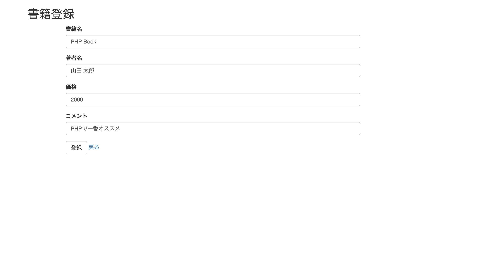
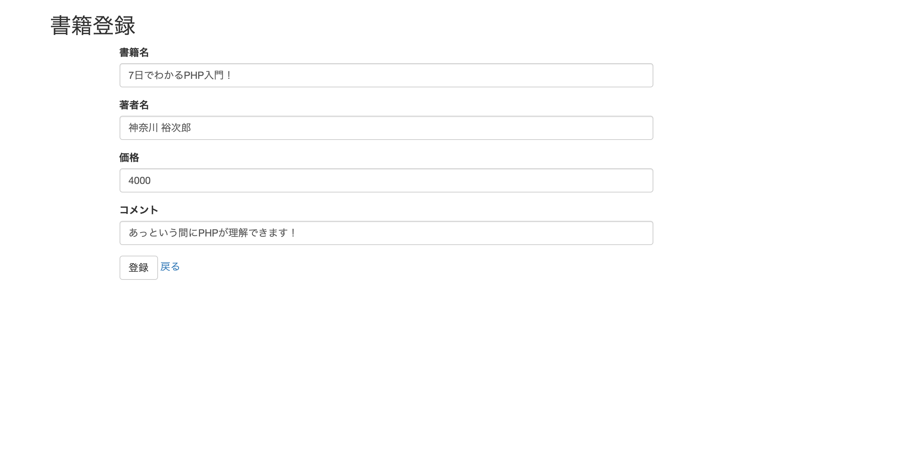
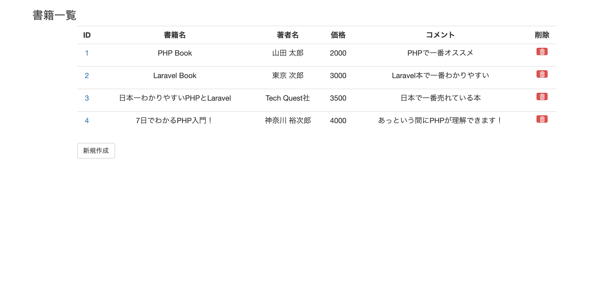
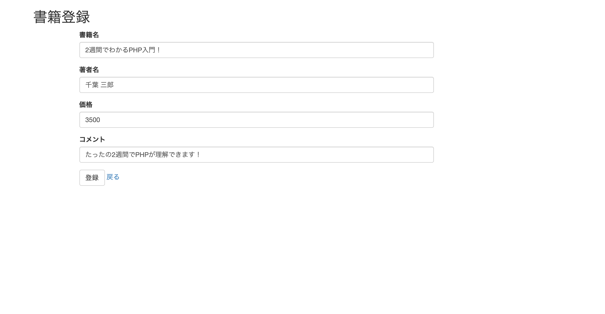
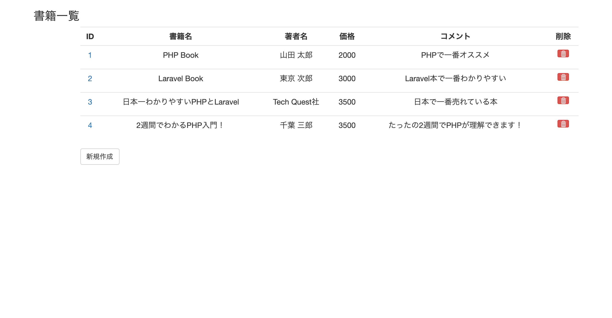
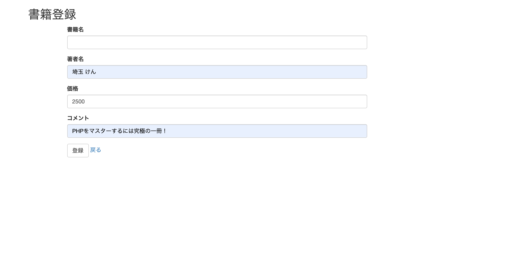

# Laravel入門　使い方チュートリアル

## 目次
[1. Laravelのインストール](#1-Laravelのインストール)

[2. Laravelプロジェクトのディレクトリ構成について](#2-Laravelプロジェクトのディレクトリ構成)

[3.データベース設定](#3-データベース設定)
 - [1.MySQLインストール](#1インストール)
 - [2.データベースの作成方法](#2データベースの作成方法)
 - [3.接続設定](#3接続設定)

[4. マイグレーション](#4-マイグレーション)
 - [1.マイグレーションファイルの作成](#1-マイグレーションファイルの作成)
 - [2.upメソッドの修正](#2-upメソッドの修正)
 - [3.マイグレーションの実行](#3-マイグレーションの実行)

[5. モデルの作成](#5-モデルの作成)
 - [1.モデルの作成](#1-モデルの作成)
 - [2.モデルの命名規則](#2-モデルの命名規則)

[6. シーディング](#6-シーディング)
 - [1.シーダーファイルの作成](#1-シーダーファイルの作成)
 - [2.テストデータの登録](#2-テストデータの登録)
 - [3.DatabaseSeeder.phpの修正](#3-DatabaseSeeder.phpの修正)

[7. ルーティング](#7-ルーティング)
 - [1.ルーティングの設定](#1-ルーティングの設定)

[8. コントローラの作成](#8-コントローラの作成)
 - [1. BookContollerの作成](#1-BookContollerの作成)
 - [2. BoolCotrollerにindexメソッドとeditメソッドを追加する](#2-BoolCotrollerにindexメソッドとeditメソッドを追加する)

[9. ビューの作成](#9-ビューの作成)
- [1.書籍一覧画面：index.blade.phpの作成](#1-書籍一覧画面indexbladephpの作成)
- [2.書籍編集画面：edit.blade.phpの作成](#2-書籍編集画面editbladephpの作成)

[10. ビューの継承](#10-ビューの継承)
- [1. 親ビュー：layout.blade.phpの作成](#1-親ビューlayoutbladephpの作成)
- [2. index.blade.phpの修正](#2-indexbladephpの修正)
- [3. layout.blade.phpの修正](#3-layoutbladephpの修正)

[11. CRUDの実装](#11-CRUDの実装)
- [1. 更新処理の作成](#1-更新処理の作成)
- [2. 削除処理の実装](#2-削除処理の実装)
- [3. 登録処理の共通化の為、form.blade.phpを作成する](#3-登録処理の共通化の為formbladephpを作成する)
- [4. form.blade.phpに@ifを追加し、formの切り替え分岐を作成する](#4-formbladephpにifを追加しformの切り替え分岐を作成する)
- [5. edit.blade.phpの修正](#5-editbladephpの修正)
- [6. 書籍登録画面：create.blade.phpの作成](#6-書籍登録画面createbladephpの作成)
- [7. BookControllerの修正](#7-BookControllerの修正)
- [8. 新規登録の動作確認](#8-新規登録の動作確認)
- [9. 編集機能の動作確認](#9-編集機能の動作確認)
- [10. 削除機能の動作確認](#10-削除機能の動作確認)

[12. バリデーション](#12-バリデーション)
- [1. BookRequest.phpの作成](#1-BookRequestphpの作成)
- [2. BookRequest.phpにバリデーションルールを記載](#2-BookRequestphpにバリデーションルールを記載)
- [3. BookController.phpの修正](#3-BookControllerphpの修正)
- [4. message.blade.phpの作成](#4-messagebladephpの作成)
- [5. form.blade.phpの修正](#5-formbladephpの修正)

## 1. Laravelのインストール

Laravelのインストールには様々な方法がありますが、ここではComposerを使用します。
create-projectコマンドを使用することで、インストールと同時にプロジェクトを作成することができます。

Macでターミナルを起動し、以下のコマンドを実行してみましょう。

```bash
% composer create-project laravel/laravel sample
```

実行が完了すると以下の表示がターミナルに表示されます。
```bash
Application key set successfully.
```
その後、lsコマンドで「sample」フォルダが作成されていることを確認したら、ディレクトリを移動します。
cdコマンドを実行します。

```bash
 % cd sample
```

以降は`sampleディレクトリで作業をしている前提でお話ししていきます`！

## 2. Laravelプロジェクトのディレクトリ構成

Laravelプロジェクトを作成すると、以下のようなディレクトリを構成します。
```bash
/sample
    ├── app       ・・・アプリケーションのロジック
    ├── bootstrap ・・・laravelフレームワークの起動コード
    ├── config    ・・・設定ファイル
    ├── database  ・・・MigrationファイルなどDB関連
    ├── public    ・・・Webサーバのドキュメントルート
    ├── resources ・・・ビューや言語変換用ファイルなど
    ├── routes    ・・・ルーティング用ファイル
    ├── storage   ・・・フレームワークが使用するファイル
    ├── tests     ・・・テストコード
    └── vendor    ・・・Composerでインストールしたライブラリ
```

> Laravelのバージョンによって構成が異なる場合があります。

この構成に従ってWebアプリケーションを作っていくことになります。
いくつか重要なファイルがあるので、実際に使用する前に簡単に紹介します。
以下のリンクから確認してください。

[Laravelの補足情報](/web_application/laravel_tutorial/about_laravel_info.md)

## 3. データベース設定

Laravelプロジェクトを作成したら、次にデータベースの設定をします。
最初は以下の作業が必要になります。

- インストール
- 接続設定
- マイグレーション
- モデル作成
- シーディング

#### **1.インストール**

ご自身の端末にMySQLのインストールをされていない方は、以下のリンクから`MySQLのインストール手順`を確認して、
インストールを行ってください。

[MySQLのインストール手順](/web_application/laravel_tutorial/install_mysql.md)

#### **2.データベースの作成方法**

MySQLのインストールを作成したら、次はデータベースを作成しましょう。
こちらも以下のリンクを確認して、データベースを作成しましょう。

[データベースの作成方法](/web_application/laravel_tutorial/create_database.md)

なお、ここで作成したデータベースを以後のチュートリアルで利用する場合は、
 - データベース名
 - データベースのユーザー名
 - データベースのパスワード

が必要になりますので、忘れずに控えておいてください。

#### **3.接続設定**

データベースへの接続情報は.envファイルに記述します。
上記のデータベースの作成方法で作成したデータベースを利用する場合は、`.env`ファイルを修正します。
.envファイルは、プロジェクトの直下に存在します。

> .env

```bash
DB_CONNECTION=mysql
DB_HOST=127.0.0.1
DB_PORT=3306
DB_DATABASE=sample
DB_USERNAME=samplelaravel
DB_PASSWORD=samplequest
```

ポイントは、
 - DB_DATABASE=sample
 - DB_USERNAME=samplelaravel
 - DB_PASSWORD=samplequest

と、データベースの作成方法のカリキュラムで作成したものを設定します、これでlaravelからデータベースへアクセスすることが出来ます。

一旦設定を反映させるために、以下のコマンドを実行します。

```bash
php artisan config:cache
```

## 4. マイグレーション

マイグレーションとは、テーブルの作成や編集などをSQLによって行うのではなく、PHPのソースで管理する仕組みです。
次の手順で行います。

1. マイグレーションファイルの作成
1. マイグレーションの実行

#### **1. マイグレーションファイルの作成**

マイグレーションファイルの作成にはArtisanのmake:migrationコマンドを使用します。
ファイル名は何でも構いませんが、どのような操作を行ったのかわかる名前をつけると良いでしょう。
booksテーブルを作成するマイグレーションファイルを作成します。

```bash
% php artisan make:migration create_books_table --create=books
```

以下のメッセージが出力されれば成功です。

```bash
Created Migration: 2018_10_30_085034_create_books_table
```

マイグレーションファイルはdatabase/migrationsディレクトリに作成されます。

> database/migrations/2018_10_30_085034_create_books_table.php
```php
<?php

use Illuminate\Database\Migrations\Migration;
use Illuminate\Database\Schema\Blueprint;
use Illuminate\Support\Facades\Schema;

class CreateBookTable extends Migration
{
    /**
     * Run the migrations.
     *
     * @return void
     */
    public function up()
    {
        Schema::create('books', function (Blueprint $table) {
            $table->id();
            $table->timestamps();
        });
    }

    /**
     * Reverse the migrations.
     *
     * @return void
     */
    public function down()
    {
        Schema::dropIfExists('books');
    }
}

```

マイグレーションファイルではupメソッドにテーブル作成時の情報、downメソッドにマイグレーションを取り消す際の情報を記述します。
現在の内容は、主キーとなるIDと、タイムスタンプを持つbooksテーブルを作成、取り消し時はbooksテーブルを削除するという内容になっています。

#### **2. upメソッドの修正**

以下のようなテーブルを作成したいとしましょう。

|物理名|型|制約|論理名|
|:--:|:--:|:--:|:--:|
|id|int|auto_increment|ID|
|title|string|NOT NULL|タイトル|
|author|string|NOT NULL|著者|
|price|int|NOT NULL|価格|
|comment|text||コメント|
|created_at|timestamp||作成日|
|updated_at|timestamp||更新日|

この場合、upメソッドを以下のように書き換えます。
先程作成されたファイルを開いて、upメソッドを修正しましょう。

>database/migrations/yyyy_mm_dd_hhssmm_create_books_table.php

```php
<?php

use Illuminate\Database\Migrations\Migration;
use Illuminate\Database\Schema\Blueprint;
use Illuminate\Support\Facades\Schema;

class CreateBooksTable extends Migration
{
    /**
     * Run the migrations.
     *
     * @return void
     */
    public function up()
    {
        Schema::create('books', function (Blueprint $table) {
            /*
            *  以下のようにテーブルに持たせる項目を書きます。
            */
            $table->increments('id');
            $table->string('title', 100);
            $table->string('author', 50);
            $table->integer('price');
            $table->text('comment')->nullable();
            $table->timestamps();
        });
    }

    /**
     * Reverse the migrations.
     *
     * @return void
     */
    public function down()
    {
        Schema::dropIfExists('books');
    }
}

```

この記述方法はスキーマビルダと呼ばれています。
詳細は公式ドキュメントを参考にしてください。
https://readouble.com/laravel/5.0/ja/schema.html

これでマイグレーションファイルの作成が完了しました。

#### **3. マイグレーションの実行**

マイグレーションの実行にはartisanのmigrateコマンドを実行します。
以下のコマンドを実行しましょう。


```bash
php artisan migrate
```
以下のようなメッセージが表示されれば成功です。
```bash
Migration table created successfully.
Migrating: 2014_10_12_000000_create_users_table
Migrated:  2014_10_12_000000_create_users_table (0.06 seconds)
Migrating: 2019_08_19_000000_create_failed_jobs_table
Migrated:  2019_08_19_000000_create_failed_jobs_table (0.02 seconds)
Migrating: 2020_08_03_105918_create_book_table
Migrated:  2020_08_03_105918_create_book_table (0.02 seconds)
```

これで、MySQLサーバー上にテーブルが作成されます。
ターミナルの画面で、「⌘ + T」を押しましょう。ターミナル上に新しいタブが表示されます。
そこで、テーブルが表示されるかを確認します。以下コマンドを実行しましょう。

```bash
$ mysql -u root -p
```

パスワードを聞かれたら、mysqlインストール時のパスワードを入力します。

以下の画面が表示されれば成功です。

```sql
Enter password:
Welcome to the MySQL monitor.  Commands end with ; or \g.
Your MySQL connection id is 550
Server version: 5.7.28 Homebrew

Copyright (c) 2000, 2019, Oracle and/or its affiliates. All rights reserved.

Oracle is a registered trademark of Oracle Corporation and/or its
affiliates. Other names may be trademarks of their respective
owners.

Type 'help;' or '\h' for help. Type '\c' to clear the current input statement.

mysql>
```

`mysql>`という表示がされれば、SQL文を入力できる状態となります。

mysqlへログインした後、まずは利用するデータベースに接続します。以下コマンドを実行して下さい。

```sql
mysql> use sample;
```

`use sample`は、データベースsampleを利用するよ！というコマンドです、今回は`sample`という名前のデータベースを
利用していますので、まずはこのコマンドを実行しました。成功するとターミナルには以下の表示がされます。

```sql
Reading table information for completion of table and column names
You can turn off this feature to get a quicker startup with -A

Database changed
```

次に以下のコマンドを実行します。このコマンドで、データベースに存在するテーブルの一覧が表示されます。

```sql
mysql> show tables;
```
結果、テーブルの一覧がターミナルに表示されます。以下booksが表示されたでしょうか？

```sql
+------------------+
| Tables_in_sample |
+------------------+
| books            |
| failed_jobs      |
| migrations       |
| users            |
+------------------+
```

> ※usersテーブルとfailed_jobsテーブルのマイグレーションファイルはプロジェクト作成時に自動的に作成されたものです。今回は無視します。
また、migrationsテーブルにはマイグレーションの情報が保存されます。


booksテーブルが指定された通りに作成されているか確認しましょう。以下のコマンドを実行してください。

```sql
mysql> show columns from books;
```

結果として、以下のbooksテーブルの構成表が表示されますので、項目の名称が正しいかを確認してみましょう。

```sql
+------------+------------------+------+-----+---------+----------------+
| Field      | Type             | Null | Key | Default | Extra          |
+------------+------------------+------+-----+---------+----------------+
| id         | int(10) unsigned | NO   | PRI | NULL    | auto_increment |
| title      | varchar(100)     | NO   |     | NULL    |                |
| author     | varchar(50)      | NO   |     | NULL    |                |
| price      | int(11)          | NO   |     | NULL    |                |
| comment    | text             | YES  |     | NULL    |                |
| created_at | timestamp        | YES  |     | NULL    |                |
| updated_at | timestamp        | YES  |     | NULL    |                |
+------------+------------------+------+-----+---------+----------------+
```

マイグレーションを取り消したい場合はmigrate:rollbackコマンドを利用します。

詳細は以下の開発をご覧ください。

[rollbackについて](/web_application/laravel_tutorial/about_rollback.md) /
[トップへ](/README.md)


## 5. モデルの作成

モデルはテーブルとマッピングされたオブジェクトです。
DB操作を行うためのクラスになります。
詳しくは「Eloquent ORM」の章で説明します。
モデルはArtisanの`make:model`コマンドで作成します。

#### **1. モデルの作成**

以下コマンドを実行しましょう。

```bash
% php artisan make:model Book
```
以下のようなメッセージが表示されれば成功です。
```bash
Model created successfully.
```

モデルはAppディレクトリ直下に作成されます。
> App/Book.php

```php
<?php

namespace App;

use Illuminate\Database\Eloquent\Model;

class Book extends Model
{
    //
}
```

中身は空ですが、一旦このままで構いません。

#### **2. モデルの命名規則**
モデルは命名規則によってテーブルとマッピングされます。
テーブル名の単数形を名前につけることで、**自動的にそのテーブルとマッピング**します。

## 6. シーディング
シーディングは、テストデータやマスタデータなどのアプリケーション起動時に必要なレコードをコマンドで登録する仕組みです。
次の手順で実行します。

1. シーダーファイルの作成
1. シーディングの実行

#### **1. シーダーファイルの作成**

シーダーファイルはArtisanの`make:seeder`コマンドを使用して作成します。

以下のコマンドを実行します。

```bash
php artisan make:seeder BooksTableSeeder
```

以下のようなメッセージが表示されれば成功です。

```bash
Seeder created successfully.
```

`database/seeds`ディレクトリにBooksTableSeeder.phpが作成されます。
> database/seeds/BooksTableSeeder.php
```php
<?php

use Illuminate\Database\Seeder;

class BooksTableSeeder extends Seeder
{
    /**
     * Run the database seeds.
     *
     * @return void
     */
    public function run()
    {
        //
    }
}
```

#### **2. テストデータの登録**

Booksテーブルに、以下のレコードを登録したいとしましょう。

|id|title|author|price|comment|created_at|updated_at|
|:--:|:--:|:--:|:--:|:--:|:--:|:--:|
|1|PHP Book|山田 太郎|2000|PHP本で一番おすすめ|現在時刻|現在時刻|
|2|Laravel Book|東京 次郎|3000|Laravel本で一番わかりやすい|現在時刻|現在時刻|
|3|日本一わかりやすいPHPとLaravel|Tech Quest社|3500|日本で一番売れている本|現在時刻|現在時刻|

その場合は、シーダーファイルのrunメソッドを以下のように修正します。
> database/seeds/BooksTableSeeder.php

```php
<?php

use Illuminate\Database\Seeder;

class BooksTableSeeder extends Seeder
{
    /**
     * Run the database seeds.
     *
     * @return void
     */
    public function run()
    {
        // booksテーブルのデータをクリアする
        DB::table('books')->truncate();

        // 初期データを用意する（列名をキーとする連想配列で用意する
        $books = [
            [
                'title' => 'PHP Book',
                'author' => '山田 太郎',
                'price' => 2000,
                'comment' => 'PHPで一番オススメ',
            ],
            [
                'title' => 'Laravel Book',
                'author' => '東京 次郎',
                'price' => 3000,
                'comment' => 'Laravel本で一番わかりやすい',
            ],
            [
                'title' => '日本一わかりやすいPHPとLaravel',
                'author' => 'Tech Quest社',
                'price' => 3500,
                'comment' => '日本で一番売れている本',
            ]
        ];

        // テストデータを登録する
        foreach ($books as $book) {
            \App\Book::create($book);
        }
    }
}
```

#### **3. DatabaseSeeder.phpの修正**

さらにDatabaseSeeder.phpのrunメソッドを以下のように修正します。runメソッド内でcallしたクラスが、シーディングコマンドで実行されるようになります。
> database/seeds/DatabaseSeeder.php

```php
<?php

use Illuminate\Database\Seeder;

class DatabaseSeeder extends Seeder
{
    /**
     * Seed the application's database.
     *
     * @return void
     */
    public function run()
    {
        // BooksTableSeederを読み込むように指定
        $this->call(BooksTableSeeder::class);
    }
}

```

以上で準備完了です。

#### 　**4. シーディングの実行**

シーディングを実行するにはArtisanの`db:seed`コマンドを実行します。以下のコマンドを実行してください。

```bash
php artisan db:seed
```

以下のようなメッセージが表示されれば成功です。

```bash
Seeding: BooksTableSeeder
Database seeding completed successfully.
```

完了したらテーブルを確認しましょう。ターミナルでmysqlを起動するコマンドを実行して、SQLを実行しましょう。

```sql
mysql> select * from books;
```

そうすると、以下のように表示されます。シーディングに定義したデータがテーブルに格納されていることがわかるかと思います。

```sql
+----+------------------------------------------+---------------+-------+---------------------------------------+---------------------+---------------------+
| id | title                                    | author        | price | comment                               | created_at          | updated_at          |
+----+------------------------------------------+---------------+-------+---------------------------------------+---------------------+---------------------+
|  1 | PHP Book                                 | 山田 太郎      |  2000 | PHPで一番オススメ                        | 2020-08-04 04:51:18 | 2020-08-04 04:51:18 |
|  2 | Laravel Book                             | 東京 次郎      |  3000 | Laravel本で一番わかりやすい               | 2020-08-04 04:51:18 | 2020-08-04 04:51:18 |
|  3 | 日本一わかりやすいPHPとLaravel              | Tech Quest社　 |  3500 | 日本で一番売れている本                    | 2020-08-04 04:51:18 | 2020-08-04 04:51:18 |
+----+------------------------------------------+---------------+-------+---------------------------------------+---------------------+---------------------+
3 rows in set (0.01 sec)
```

以上でデータベース関連の設定は完了です。
作業量が多かったかもしれませんが一度作ってしまえば、プロジェクトを共有しているユーザー全てが`migrate`と`db:seed`の2つのコマンドのみで、DBの初期化を行うことができます。

## 7. ルーティング
データベースの準備が整ったらアプリケーションを作成します。
まずはルーティングから行なっていきましょう。

以下のリンクでルーティングの詳細な説明をしていますので、初めてチャレンジする方はまずこちらを確認しましょう！

[ルーティングとは](/web_application/laravel_tutorial/about_routes.md)

#### **1. ルーティングの設定**

それでは、ルーティングの設定をしましょう。以下をweb.phpに記載しましょう。

Route::resourceメソッドを使用することで、Restfulなルーティングを行うことができます。

> routes/web.php
```php
<?php

use Illuminate\Support\Facades\Route;

/*
|--------------------------------------------------------------------------
| Web Routes
|--------------------------------------------------------------------------
|
| Here is where you can register web routes for your application. These
| routes are loaded by the RouteServiceProvider within a group which
| contains the "web" middleware group. Now create something great!
|
*/

Route::resource('book', 'BookController');
```

上記の通り設定すると、このURLでのアクセスだったらBookContoroller側のこのメソッドに処理をさせなさい、というルーティングを設定することが出来ます。

ルーティングを設定すると、以下の通りとなります。

|リクエストメソッド|URI|コントローラー|CRUD画面を作る際の主な用途|
|:--:|:--:|:--:|:--:|
|GET|/book|BookController@index|一覧画面の表示|
|GET|/book/{book}|BookController@show|詳細画面の表示|
|GET|/book/create|BookController@create|登録画面の表示|
|POST|/book|BookController@store|登録処理|
|GET|/book/{book}/edit|BookController@edit|編集画面の表示|
|PUT|/book/{book}|BookController@update|編集処理|
|DELETE|/book/{book}|BookController@destroy|削除処理|

`以降、resourceメソッドでルーティングしている前提でコントローラを作成します。`

## 8. コントローラの作成
ルーティングを設定したら次はコントローラを作成します。
コントローラはルーティングされてきたリクエストを受け取り、レスポンスを作成する役割を果たします。
レスポンスとしてHTMLを返す場合はViewに処理を依頼します。

#### **1. BookContollerの作成**
コントローラの作成にはArtisanの`make:controller`コマンドを使用します。

```bash
php artisan make:controller BookController
```

以下のようなメッセージが表示されれば成功です。

```bash
Controller created successfully.
```

コントローラは`app/Http/Controllers`ディレクトリに作成されます。

#### **2. BoolCotrollerにindexメソッドとeditメソッドを追加する**

以下のようにindexメソッドとeditメソッドを追加してください。
また、`use App\Book`の記述を忘れないようにしてください。

> app/Http/Controllers/BookController.php

```php
<?php

namespace App\Http\Controllers;

use Illuminate\Http\Request;
use App\Http\Controllers\Controller;
use App\Book;

class BookController extends Controller
{
  public function index()
  {
      // DBよりBookテーブルの値を全て取得
      $books = Book::all();

      // 取得した値をビュー「book/index」に渡す
      return view('book/index', compact('books'));
  }

  public function edit($id)
  {
      // DBよりURIパラメータと同じIDを持つBookの情報を取得
      $book = Book::findOrFail($id);

      // 取得した値をビュー「book/edit」に渡す
      return view('book/edit', compact('book'));
  }
}
```

コントローラのメソッドでビュー（画面表示のプログラムファイル）を返したい場合、view関数を使用します。

view関数は第一引数にビューの名前、第二引数にビューに渡したい値を設定します。
第二引数は連想配列で渡すようにします。
compact関数を使うことで簡単に連想配列を渡すことができます。
例えば、edit関数の`compact('book')`は`['book' => $book]`としているのと同じ意味です。

ルーティングされているメソッドのうち、まずはindexメソッドとeditメソッドを用意しました。

DBからの値取得はEloquentという仕組みを利用しています。Eloquentに関しては「Eloquent ORM」の章で説明します。

## 9. ビューの作成

では最後にビューを作成しましょう。
ビューは`resources/views`ディレクトリに作成します。

#### **1. 書籍一覧画面：index.blade.phpの作成**

bookディレクトリを作成し、その中にindex.blade.phpを作成しましょう。

> resources/views/book/index.blade.php

```php
<head>
  <title>Laravel Sample</title>
  <link rel="stylesheet" href="https://maxcdn.bootstrapcdn.com/bootstrap/3.3.7/css/bootstrap.min.css">
</head>
<div class="container ops-main">
    <div class="row">
        <div class="col-md-12">
            <h3 class="ops-title">書籍一覧</h3>
        </div>
    </div>
    <div class="row">
        <div class="col-md-11 col-md-offset-1">
            <table class="table text-center">
                <tr>
                    <th class="text-center">ID</th>
                    <th class="text-center">書籍名</th>
                    <th class="text-center">価格</th>
                    <th class="text-center">著者</th>
                    <th class="text-center">削除</th>
                </tr>
                @foreach($books as $book)
                <tr>
                    <td>
                        <a href="/book/{{ $book->id }}/edit">{{ $book->id }}</a>
                    </td>
                    <td>{{ $book->title }}</td>
                    <td>{{ $book->author }}</td>
                    <td>{{ $book->price }}</td>
                    <td>{{ $book->comment }}</td>
                    <td>
                        <form action="/book/{{ $book->id }}" method="post">
                            <input type="hidden" name="_method" value="DELETE">
                            <input type="hidden" name="_token" value="{{ csrf_token() }}">
                            <button type="submit" class="btn btn-xs btn-danger" aria-label="Left Align"><span
                                    class="glyphicon glyphicon-trash"></span></button>
                        </form>
                    </td>
                </tr>
                @endforeach
            </table>
           <div><a href="/book/create" class="btn btn-default">新規作成</a></div>
        </div>
    </div>
</div>
```

Laravelではビューの作成にBladeというテンプレートエンジンを用いています。
Bladeでは{{ $variables }}とすることで、コントローラから受け取った値を画面に出力することができます。

また`@foreach($array as $elem)`や`@if($bool)`と記述することで、blade内で制御構文を使用することもできます。

その場合、制御構文の終端は@endforeach、@endifと記述します。

Bladeの詳細に関しては以下のサイトで確認してください。

https://readouble.com/laravel/5.7/ja/blade.html

ここまで完成したら、Artisanでサーバーを立ち上げ、http://localhost:8000/book にアクセスしてみましょう。
一覧画面が表示されるはずです。

サーバーの起動方法は、以下を参照してください。

[laravelサーバー起動手順](/web_application/laravel_tutorial/start_server.md)

> 一覧画面


一度サーバーを停止したら、ここで一度流れを整理しておきましょう。
以下の`route:list`コマンドでルーティングを再確認します。

```bash
php artisan route:list
```
以下の結果が表示されるされれば成功です。
```bash
+--------+-----------+------------------+--------------+---------------------------------------------+------------+
| Domain | Method    | URI              | Name         | Action                                      | Middleware |
+--------+-----------+------------------+--------------+---------------------------------------------+------------+
|        | GET|HEAD  | /                |              | Closure                                     | web        |
|        | GET|HEAD  | api/user         |              | Closure                                     | api        |
|        |           |                  |              |                                             | auth:api   |
|        | GET|HEAD  | book             | book.index   | App\Http\Controllers\BookController@index   | web        |
|        | POST      | book             | book.store   | App\Http\Controllers\BookController@store   | web        |
|        | GET|HEAD  | book/create      | book.create  | App\Http\Controllers\BookController@create  | web        |
|        | GET|HEAD  | book/{book}      | book.show    | App\Http\Controllers\BookController@show    | web        |
|        | PUT|PATCH | book/{book}      | book.update  | App\Http\Controllers\BookController@update  | web        |
|        | DELETE    | book/{book}      | book.destroy | App\Http\Controllers\BookController@destroy | web        |
|        | GET|HEAD  | book/{book}/edit | book.edit    | App\Http\Controllers\BookController@edit    | web        |
+--------+-----------+------------------+--------------+---------------------------------------------+------------+
```

今、ブラウザからhttp://localhost:8000/book にアクセスしました。
つまりGETリクエストでbookにアクセスしたことになります。
その場合、BookControllerのindexメソッドが呼び出されるように設定されていました。


```bash
+--------+-----------+------------------+--------------+---------------------------------------------+------------+
| Domain | Method    | URI              | Name         | Action                                      | Middleware |
+--------+-----------+------------------+--------------+---------------------------------------------+------------+
|        | GET|HEAD  | /                |              | Closure                                     | web        |
|        | GET|HEAD  | api/user         |              | Closure                                     | api        |
|        |           |                  |              |                                             | auth:api   |
|        | GET|HEAD  | book             | book.index   | App\Http\Controllers\BookController@index   | web        |
+--------+-----------+------------------+--------------+---------------------------------------------+------------+
```

そのため、BookControllerのindexメソッドが呼び出されます。
indexメソッドでは、書籍の一覧情報を取得し、resources/views/book/index.blade.phpに渡しました。

> app/Http/Controllers/BookController.php
```php
public function index()
{
    // DBよりBookテーブルの値を全て取得
    $books = Book::all();

    // 取得した値をビュー「book/index」に渡す
    return view('book/index', compact('books'));
}
```

最後にindex.blade.phpでは受け取った値を元に画面を生成し、それが最終的にブラウザに表示されたというわけです。

#### **2. 書籍編集画面：edit.blade.phpの作成**

では、次にedit.blade.phpを作成しましょう。今の流れを意識しながら作成してください。
> resources/views/book/edit.blade.php

```php
<head>
    <title>Laravel Sample</title>
    <link rel="stylesheet" href="https://maxcdn.bootstrapcdn.com/bootstrap/3.3.7/css/bootstrap.min.css">
</head>
<div class="container ops-main">
    <div class="row">
        <div class="col-md-6">
            <h2>書籍登録</h2>
        </div>
    </div>
    <div class="row">
        <div class="col-md-8 col-md-offset-1">
            <form action="/book/{{ $book->id }}" method="post">
                <input type="hidden" name="_method" value="PUT">
                <input type="hidden" name="_token" value="{{ csrf_token() }}">
                <div class="form-group">
                    <label for="title">書籍名</label>
                    <input type="text" class="form-control" name="title" value="{{ $book->title }}">
                </div>
                <div class="form-group">
                    <label for="author">著者名</label>
                    <input type="text" class="form-control" name="author" value="{{ $book->author }}">
                </div>
                <div class="form-group">
                    <label for="price">価格</label>
                    <input type="text" class="form-control" name="price" value="{{ $book->price }}">
                </div>
                <div class="form-group">
                    <label for="comment">コメント</label>
                    <input type="text" class="form-control" name="comment" value="{{ $book->comment }}">
                </div>
                <button type="submit" class="btn btn-default">登録</button>
                <a href="/book">戻る</a>
            </form>
        </div>
    </div>
</div>
```

これで編集画面が作成できました。

サーバーを起動して一覧画面に遷移し、書籍一覧のIDをクリックすると、編集画面に遷移することが確認できます。

サーバーの起動方法は、以下を参照してください。

[laravelサーバー起動手順](/web_application/laravel_tutorial/start_server.md)

> 編集画面




上記のように、一覧画面のIDをクリックすると、そのIDに対応する編集画面が上記のように表示されたらOKです。


## 10. ビューの継承

ところで、書籍一覧画面と書籍登録画面のヘッダー部分のプログラムは同じですね。
また、システムではヘッダーやサイドバーなど、すべての画面で共通して同じ表示レイアウトにしたい場合などもあります。

 - 複数の画面で、共通した定義やレイアウトを使用する

もし、システムの画面が数多く存在し、同じ定義やレイアウトを使用したいのに、画面の数だけ同じプログラムを用意するとどうなるでしょうか？以下の問題点があります。

 - 定義や動作に不具合があると、同じプログラムなのに、修正数が増加する

これにより、その数だけ修正をしなければなりませんので、修正数や直した箇所のテストなどが増えることになります。

そこで、同じプログラムを書いているのであれば、1つのプログラムにして、利用する所でそのプログラムを読み込むようにします。

これを、`ビューの継承`と言います。

継承を利用すると、効率的にシステムを作成することができます。

共通のビューファイルを、`親ビュー`と言い、親のビューを読み込む方を、`子ビュー`といいます。

#### **1. 親ビュー：layout.blade.phpの作成**
親ビューになるlayout.blade.phpを作成します。共通となる要素のみ記述します。

> views/book/layout.blade.php
```php
<head>
    <title>Laravel Sample</title>
    <link rel="stylesheet" href="https://maxcdn.bootstrapcdn.com/bootstrap/3.3.7/css/bootstrap.min.css">
</head>
@yield('content')
```

#### **2. index.blade.phpの修正**
次にindex.blade.phpを書き換えます。

```php
@extends('book/layout')
@section('content')
<div class="container ops-main">
    <div class="row">
        <div class="col-md-12">
            <h3 class="ops-title">書籍一覧</h3>
        </div>
    </div>
    <div class="row">
        <div class="col-md-11 col-md-offset-1">
            <table class="table text-center">
                <tr>
                    <th class="text-center">ID</th>
                    <th class="text-center">書籍名</th>
                    <th class="text-center">著者名</th>
                    <th class="text-center">価格</th>
                    <th class="text-center">コメント</th>
                    <th class="text-center">削除</th>
                </tr>
                @foreach($books as $book)
                <tr>
                    <td>
                        <a href="/book/{{ $book->id }}/edit">{{ $book->id }}</a>
                    </td>
                    <td>{{ $book->title }}</td>
                    <td>{{ $book->author }}</td>
                    <td>{{ $book->price }}</td>
                    <td>{{ $book->comment }}</td>
                    <td>
                        <form action="/book/{{ $book->id }}" method="post">
                            <input type="hidden" name="_method" value="DELETE">
                            <input type="hidden" name="_token" value="{{ csrf_token() }}">
                            <button type="submit" class="btn btn-xs btn-danger" aria-label="Left Align"><span
                                    class="glyphicon glyphicon-trash"></span></button>
                        </form>
                    </td>
                </tr>
                @endforeach
            </table>
            <div><a href="/book/create" class="btn btn-default">新規作成</a></div>
        </div>
    </div>
</div>
@endsection
```

共通要素を消去し、代わりに@extends('book/layout')を記述します。
これで、layout.blade.phpを継承することを宣言したことになります。
すると、layoutの@yield('content')部分に@section('content')〜@endsectionで囲った部分が挿入されます。

#### **3. layout.blade.phpの修正**
では、edit.blade.phpにもlayoutを継承させましょう。

> resources/views/book/edit.blade.php

```php
@extends('book/layout')
@section('content')
<div class="container ops-main">
    <div class="row">
        <div class="col-md-6">
            <h2>書籍登録</h2>
        </div>
    </div>
    <div class="row">
        <div class="col-md-8 col-md-offset-1">
            <form action="/book/{{ $book->id }}" method="post">
                <input type="hidden" name="_method" value="PUT">
                <input type="hidden" name="_token" value="{{ csrf_token() }}">
                <div class="form-group">
                    <label for="title">書籍名</label>
                    <input type="text" class="form-control" name="title" value="{{ $book->title }}">
                </div>
                <div class="form-group">
                    <label for="author">著者名</label>
                    <input type="text" class="form-control" name="author" value="{{ $book->author }}">
                </div>
                <div class="form-group">
                    <label for="price">価格</label>
                    <input type="text" class="form-control" name="price" value="{{ $book->price }}">
                </div>
                <div class="form-group">
                    <label for="comment">コメント</label>
                    <input type="text" class="form-control" name="comment" value="{{ $book->comment }}">
                </div>
                <button type="submit" class="btn btn-default">登録</button>
                <a href="/book">戻る</a>
            </form>
        </div>
    </div>
</div>
@endsection
```

共通のCSSの読み込みや、フッター、ヘッダーなどをlayout.blade.phpに記入することで、継承している全ての画面に反映させることができます。

では、一覧画面と編集画面が正しく表示されているかを、サーバーを起動して確認しておきましょう。
サーバーの起動方法は、以下を参照してください。

[laravelサーバー起動手順](/web_application/laravel_tutorial/start_server.md)

次はDB操作の処理を実装していくことになりますが、その前に`Eloquent`について学びましょう。
Eloquentについては以下のリンクを参照して学習してください。

[Eloquentについて](/web_application/laravel_tutorial/about_Eloquent.md)

Eloquentを理解したら、次の実装に移りましょう。


## 11. CRUDの実装

では残していた更新、登録、削除の機能を実装していきましょう。
まずは更新を作成します。

#### **1. 更新処理の作成**
編集画面はできているので、コントローラにupdateメソッドを定義します。

> app/Http/Controllers/BookController.php

```php
<?php

namespace App\Http\Controllers;

use Illuminate\Http\Request;
use App\Http\Controllers\Controller;
use App\Book;

class BookController extends Controller
{
    public function index()
    {
        // DBよりBookテーブルの値をすべて取得
        $books = Book::all();

        // 取得した値をビュー「book/index」に渡す
        return view('book/index', compact('books'));
    }

    public function edit($id)
    {
        // DBよりURIパラメータと同じIDを持つBookの情報を取得
        $book = Book::findOrFail($id);

        // 取得した値をビュー「book/edit」に渡す
        return view('book/edit', compact('book'));
    }

    public function update(BookRequest $request, $id)
    {
        $book = Book::findOrFail($id);
        $book->title = $request->title;
        $book->author = $request->author;
        $book->price = $request->price;
        $book->comment = $request->comment;
        $book->save();
        return redirect("/book");
    }
}
```

updateメソッドの$idにはURI：`book/{book}`の{book}の部分の値が代入されます。
つまり、http://localhost:8000/book/3 にPUTメソッドでアクセスしたら、updateメソッドが呼び出され、idに3が代入されます。
requestはクライアントからのリクエスト情報が入っています。
クライアントが入力した値を取得する場合は`$request->[要素名]`で取得します。

#### **2. 削除処理の実装**
書籍一覧画面にすでに削除ボタンは作成しているので、コントローラにdestroyメソッドを定義します。

> app/Http/Controllers/BookController.php
```php
<?php

namespace App\Http\Controllers;

use Illuminate\Http\Request;
use App\Http\Controllers\Controller;
use App\Book;

class BookController extends Controller
{
    public function index()
    {
        // DBよりBookテーブルの値をすべて取得
        $books = Book::all();

        // 取得した値をビュー「book/index」に渡す
        return view('book/index', compact('books'));
    }

    public function create()
    {
        $book = new Book();
        return view('book/create', compact('book'));
    }

    public function store(Request $request)
    {
        $book = new Book();
        $book->title = $request->title;
        $book->author = $request->author;
        $book->price = $request->price;
        $book->comment = $request->comment;
        $book->save();
        return redirect("/book");
    }

    public function edit($id)
    {
        // DBよりURIパラメータと同じIDを持つBookの情報を取得
        $book = Book::findOrFail($id);

        // 取得した値をビュー「book/edit」に渡す
        return view('book/edit', compact('book'));
    }

    public function update(Request $request, $id)
    {
        $book = Book::findOrFail($id);
        $book->title = $request->title;
        $book->author = $request->author;
        $book->price = $request->price;
        $book->comment = $request->comment;
        $book->save();
        return redirect("/book");
    }

    public function destroy($id)
    {
        $book = Book::findOrFail($id);
        $book->delete();

        return redirect("/book");
    }
}
```

#### **3. 登録処理の共通化の為、form.blade.phpを作成する**

最後に登録処理ですが、画面はedit.blade.phpとほぼ同じなので、再利用するようにしましょう。
まず`views/book`ディレクトリに共通部分を記述するform.blade.phpを作成します。
edit.blade.phpの@section内部を全て移動させます。

> resources/views/book/form.blade.php
```php
<div class="container ops-main">
    <div class="row">
        <div class="col-md-6">
            <h2>書籍登録</h2>
        </div>
    </div>
    <div class="row">
        <div class="col-md-8 col-md-offset-1">
            <form action="/book/{{ $book->id }}" method="post">
                <input type="hidden" name="_method" value="PUT">
                <input type="hidden" name="_token" value="{{ csrf_token() }}">
                <div class="form-group">
                    <label for="name">書籍名</label>
                    <input type="text" class="form-control" name="name" value="{{ $book->title }}">
                </div>
                <div class="form-group">
                    <label for="name">著者名</label>
                    <input type="text" class="form-control" name="name" value="{{ $book->author }}">
                </div>
                <div class="form-group">
                    <label for="price">価格</label>
                    <input type="text" class="form-control" name="price" value="{{ $book->price }}">
                </div>
                <div class="form-group">
                    <label for="comment">コメント</label>
                    <input type="text" class="form-control" name="author" value="{{ $book->comment }}">
                </div>
                <button type="submit" class="btn btn-default">登録</button>
                <a href="/book">戻る</a>
            </form>
        </div>
    </div>
</div>
```

次に新規登録時と更新時で異なる部分だけ`@if`を使用して分岐させます。
今回の場合、formタグ部分だけ書き換えればOKです。

#### **4. form.blade.phpに@ifを追加し、formの切り替え分岐を作成する**

<form>タグを、新規登録画面と編集画面の場合で、以下のように分岐させる処理を書きます。

@ifで、変数$targetがstoreならば、新規画面用としてメソッドをpost、
@elseifにより変数$targetがupdateならば、methodはHTMLの仕様上postとgetしか記載が出来ませんが、
hiddenタグに_method、value="PUT"を定義すれば、methodをPUTとして送付することが出来ます。


これは、ルーティング定義を思い出して頂き、編集のルーティングではメソッドがPUTだからとなります。

では、実際に修正しましょう。

```php
    @if($target == 'store')
        <form action="/book" method="post">
    @elseif($target == 'update')
        <form action="/book/{{ $book->id }}" method="post">
        <input type="hidden" name="_method" value="PUT">
    @endif
```

>resources/views/book/form.blade.php

```php
<div class="container ops-main">
    <div class="row">
        <div class="col-md-6">
            <h2>書籍登録</h2>
        </div>
    </div>
    <div class="row">
        <div class="col-md-8 col-md-offset-1">
            @if($target == 'store')
            <form action="/book" method="post">
                @elseif($target == 'update')
                <form action="/book/{{ $book->id }}" method="post">
                    <input type="hidden" name="_method" value="PUT">
                    @endif
                    <input type="hidden" name="_token" value="{{ csrf_token() }}">
                    <div class="form-group">
                        <label for="title">書籍名</label>
                        <input type="text" class="form-control" name="title" value="{{ $book->title }}">
                    </div>
                    <div class="form-group">
                        <label for="author">著者名</label>
                        <input type="text" class="form-control" name="author" value="{{ $book->author }}">
                    </div>
                    <div class="form-group">
                        <label for="price">価格</label>
                        <input type="text" class="form-control" name="price" value="{{ $book->price }}">
                    </div>
                    <div class="form-group">
                        <label for="comment">コメント</label>
                        <input type="text" class="form-control" name="comment" value="{{ $book->comment }}">
                    </div>
                    <button type="submit" class="btn btn-default">登録</button>
                    <a href="/book">戻る</a>
                </form>
        </div>
    </div>
</div>
```

#### **5. edit.blade.phpの修正**

次はedit.blade.phpを以下のように書き換えます。

> resources/views/book/edit.blade.php
```php
@extends('book/layout')
@section('content')
@include('book/form', ['target' => 'update'])
@endsection
```

`@include`を使用して、form.blade.phpを`@section`内に挿入します。
その際、target変数にupdateという値を渡します。

#### **6. 書籍登録画面：create.blade.phpの作成**

では、新しく`views/book/`ディレクトリにcreate.blade.phpを作成しましょう。

> resources/views/book/create.blade.php

```php
@extends('book/layout')
@section('content')
@include('book/form', ['target' => 'store'])
@endsection
```

targetをstoreに書き換えるだけです。
これで、新規登録の時と編集の時で、formの内容が分岐される仕組みができます。
登録時のコントローラが未作成ですので`createメソッドとstoreメソッドを追加`しましょう。

#### **7. BookControllerの修正**

> app/Http/Controllers/BookController.php

```php
<?php

namespace App\Http\Controllers;

use Illuminate\Http\Request;
use App\Http\Controllers\Controller;
use App\Book;

class BookController extends Controller
{
    public function index()
    {
        // DBよりBookテーブルの値をすべて取得
        $books = Book::all();

        // 取得した値をビュー「book/index」に渡す
        return view('book/index', compact('books'));
    }

    public function create()
    {
        $book = new Book();
        return view('book/create', compact('book'));
    }

    public function store(Request $request)
    {
        $book = new Book();
        $book->title = $request->title;
        $book->author = $request->author;
        $book->price = $request->price;
        $book->comment = $request->comment;
        $book->save();
        return redirect("/book");
    }

    public function edit($id)
    {
        // DBよりURIパラメータと同じIDを持つBookの情報を取得
        $book = Book::findOrFail($id);

        // 取得した値をビュー「book/edit」に渡す
        return view('book/edit', compact('book'));
    }

    public function update(Request $request, $id)
    {
        $book = Book::findOrFail($id);
        $book->title = $request->title;
        $book->author = $request->author;
        $book->price = $request->price;
        $book->comment = $request->comment;
        $book->save();
        return redirect("/book");
    }

    public function destroy($id)
    {
        $book = Book::findOrFail($id);
        $book->delete();

        return redirect("/book");
    }
}
```

create.blade.phpでは$bookを受け取るようになっています。
そこで、createメソッドでは空のインスタンスを渡すようにします。
画面には空の状態で出力されるようになります。

> 変数を渡さないとUndefined Variableエラーになってしまいます。

以上でCRUD処理全てが実装できました。

では、ここで、新規登録画面、編集画面、削除機能が実際に動作するかを検証しましょう。
動作しない場合は何かしらプログラムに問題がありますので、改めて上記チュートリアルと見比べながら解決してください。
それではサーバーを起動しましょう。サーバーの起動方法は、以下を参照してください。

[laravelサーバー起動手順](/web_application/laravel_tutorial/start_server.md)

#### **8. 新規登録の動作確認**

まずは一覧画面に遷移します。URLは、http://localhost:8000/book ですね。

> 一覧画面


画面したの`新規作成ボタン`をクリックしましょう。
書籍登録の画面に移りましたか？4つの入力項目がありますので、以下の通り入力しましょう。

 - 書籍名　→　7日でわかるPHP入門！
 - 著者名　→　神奈川 裕次郎
 - 価格　　→　4000
 - コメント →　あっという間にPHPが理解できます！

入力すると以下のようになります。


確認できたら、登録ボタンをクリックしましょう。一覧画面に新たに4つ目の本がID4として、表示されたと思います。



以上が新規登録の動作確認でした。もしエラーなどになったら、プログラムを見直してみましょう。

#### **9. 編集機能の動作確認**

新規登録で入力した情報がすべて間違っていたため。修正したいと思います。先程のIDが4の箇所をクリックして、編集画面に移ります。以下のように変更しましょう。

 - 書籍名　→　2週間でわかるPHP入門！
 - 著書名　→　千葉 三郎
 - 価格　　→　3500
 - コメント →　たったの2週間でPHPが理解できます！



上記を確認したら、登録ボタンをクリックしましょう。一覧画面に遷移して、変更内容がID4に表示されたかを確認しましょう。



以上が編集機能の動作確認でした。もしエラーなどになったら、プログラムを見直してみましょう。

#### **10. 削除機能の動作確認**

最後に、削除機能を確認しましょう、折角登録したましたが、ID4の本の情報を削除しましょう。

一覧画面の右端にゴミ箱のアイコンが表示されていると思います。ID4の箇所のゴミ箱ボタンを押しましょう。
一覧画面からID4の書籍情報が消えている事が確認できます。


## 12. バリデーション

最後にバリデーションを作成しましょう。
バリデーションとは入力内容のチェックのことです。
いくつか方法がありますが、フォームリクエストを作成する方法を紹介します。
フォームリクエストを作成するにはArtisanの`make:request`を使用します。

#### **1. BookRequest.phpの作成**
以下のコマンドを実行してください。

```bash
php artisan make:request BookRequest
```

以下のメッセージが表示されれば成功です。

```bash
Request created successfully.
```

新たに`app/Http/Requests`ディレクトリが作成され、そこにBookRequest.phpが作成されます。

#### **2. BookRequest.phpにバリデーションルールを記載**

BookRequest.phpのauthorizeメソッドと、rulesメソッドを以下のように修正します。

> app/Http/Requests/BookRequest.php

```php
<?php

namespace App\Http\Requests;

use Illuminate\Foundation\Http\FormRequest;

class BookRequest extends FormRequest
{
    /**
     * Determine if the user is authorized to make this request.
     *
     * @return bool
     */
    public function authorize()
    {
        // trueに変更します
        return true;
    }

    public function rules()
    {
        return [
            'title' => 'required|string|max:100',
            'author' => 'required|string|max:50',
            'price' => 'required|integer',
            'comment' => 'nullable',
       ];
    }
}
```

> ※authorizeメソッドのreturnは、忘れずにtrueに変更します。
（falseを返した場合は403ステータスコードのレスポンスが返されます。）


連想配列の値のはバリデーションルールを記述します。

|名前|ルール|
|:--:|:--:|
|required|必須入力|
|string|文字列のみ|
|max:50|50文字以下|
|integer|数値のみ|
|nullable|空もOK|

バリデーションルールの詳細に関しては公式サイトを参考にしてください。
https://readouble.com/laravel/5.7/ja/validation.html


#### **3. BookController.phpの修正**

次にBookController.phpのstoreメソッドとupdateメソッドの引数の型指定をRequestからBookRequestに書き換えます。

また、`use App\Http\Requests\BookRequest;`の記載を忘れないようにしてください。

> app/Http/Contorllers/BookController.php

```php
<?php

namespace App\Http\Controllers;

use Illuminate\Http\Request;
use App\Http\Requests\BookRequest;
use App\Http\Controllers\Controller;
use App\Book;

class BookController extends Controller
{
    public function index()
    {
        // DBよりBookテーブルの値をすべて取得
        $books = Book::all();

        // 取得した値をビュー「book/index」に渡す
        return view('book/index', compact('books'));
    }

    public function create()
    {
        $book = new Book();
        return view('book/create', compact('book'));
    }

    /**
     * storeメソッド内部の$requestの型を、BookRequestに変更します
     */
    public function store(BookRequest $request)
    {
        $book = new Book();
        $book->title = $request->title;
        $book->author = $request->author;
        $book->price = $request->price;
        $book->comment = $request->comment;
        $book->save();
        return redirect("/book");
    }

    public function edit($id)
    {
        // DBよりURIパラメータと同じIDを持つBookの情報を取得
        $book = Book::findOrFail($id);

        // 取得した値をビュー「book/edit」に渡す
        return view('book/edit', compact('book'));
    }

    /**
     * updateメソッド内部の$requestの型を、BookRequestに変更します
     */
    public function update(BookRequest $request, $id)
    {
        $book = Book::findOrFail($id);
        $book->title = $request->title;
        $book->author = $request->author;
        $book->price = $request->price;
        $book->comment = $request->comment;
        $book->save();
        return redirect("/book");
    }

    public function destroy($id)
    {
        $book = Book::findOrFail($id);
        $book->delete();

        return redirect("/book");
    }
}
```

これで書籍名を空にしたまま登録や編集しようとすると、同じ画面にリダイレクトするようになります。
実際に新規登録画面で、著書名の入力を無しにして登録ボタンをクリックしてください。

しかし、このままでは何が起きているのかわからないので、エラーメッセージを表示するようにしましょう。

#### **4. message.blade.phpの作成**

`views/book`ディレクトリにmessage.blade.phpを作成します。

> resources/views/book/message.blade.php

```php
<div class="row">
    <div class="col-md-12">
    @if ($errors->any())
        <div class="alert alert-danger">
          <ul>
              @foreach ($errors->all() as $error)
                  <li>{{ $error }}</li>
              @endforeach
          </ul>
        </div>
    @endif
    </div>
</div>
```

#### **5. form.blade.phpの修正**

次に、form.blade.phpに、message.blade.phpを挿入します。
挿入は、@includeを用いましょう。挿入する位置は、

    <div class="col-md-8 col-md-offset-1">

のすぐ下です。

> resources/views/book/form.blade.php

```php
<div class="container ops-main">
    <div class="row">
        <div class="col-md-6">
            <h2>書籍登録</h2>
        </div>
    </div>
    <div class="row">
        <div class="col-md-8 col-md-offset-1">
            @include('book/message')
            @if($target == 'store')
            <form action="/book" method="post">
                @elseif($target == 'update')
                <form action="/book/{{ $book->id }}" method="post">
                    <input type="hidden" name="_method" value="PUT">
                    @endif
                    <input type="hidden" name="_token" value="{{ csrf_token() }}">
                    <div class="form-group">
                        <label for="title">書籍名</label>
                        <input type="text" class="form-control" name="title" value="{{ $book->title }}">
                    </div>
                    <div class="form-group">
                        <label for="author">著者名</label>
                        <input type="text" class="form-control" name="author" value="{{ $book->author }}">
                    </div>
                    <div class="form-group">
                        <label for="price">価格</label>
                        <input type="text" class="form-control" name="price" value="{{ $book->price }}">
                    </div>
                    <div class="form-group">
                        <label for="comment">コメント</label>
                        <input type="text" class="form-control" name="comment" value="{{ $book->comment }}">
                    </div>
                    <button type="submit" class="btn btn-default">登録</button>
                    <a href="/book">戻る</a>
                </form>
        </div>
    </div>
</div>
```

これでエラーメッセージが表示されるようになります。
実際に動作をさせてみましょう。

新規登録画面に遷移して、書籍名の入力を行わずに、他を入力して登録ボタンをクリックしましょう。



以下のような、「The title field is required.」というエラーメッセージが画面上部に出力されれば成功です。


以上でCRUD機能を持つWebアプリケーションが完成しました。

[戻る](/web_application/index.md) /
[トップへ](/README.md)