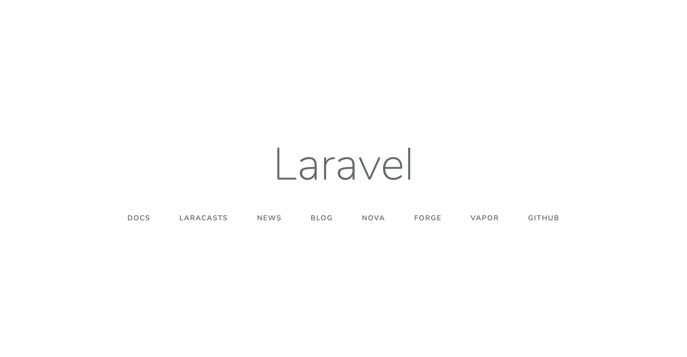

## Laravelサーバー起動手順（ローカル環境）

プログラムを書いたりし、実際に画面から動作を確認したいという場合には、サーバーを起動する必要があります。

laravelのプロジェクトが保存されているフォルダにまず移動します。
例) sampleプロジェクトが以下のディレクトリにある場合
```bash
/Users/[自分のパソコン名]/project/sample
```

cdコマンドで移動します。

```bash
cd /Users/[自分のパソコン名]/project/sample
```

起動したら、以下のコマンドを実行します。

```bash
php artisan serve --host=localhost --port=8000
```

実行が成功すると以下の画面表示が出ます。

```bash
Laravel development server started: http://localhost:8000
```

実際に、上記に表示されている「http://localhost:8000」をGoogle ChromeなどのURLバーに入力すると、以下の画面が表示されます。



これは、laravelプロジェクトのsample内にある`web.php`が以下のルーティング定義がされているからです。

```php
Route::get('/', function () {
    return view('welcome');
});
```

URL:http://localhost:8000/ が上記ルーティングに対応し、このアドレスにアクセスしたらwelcome.blade.phpを表示するという解釈になります。ルーティングについては以下を参照してください。

[ルーティングとは](/web_application/laravel_tutorial/about_routes.md)

サーバーの起動を停止するときはターミナル上で以下の通り、キーボードを入力します。

 - control + c

これにより、サーバーが停止され、ターミナルでコマンド入力ができるようになります。

以上です。お疲れさまでした。

[laravelチュートリアルに戻る](/web_application/laravel_tutorial.md) /
[トップへ](/README.md)